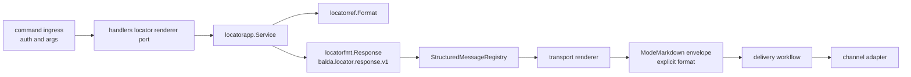

# Presentation routing for model text and structured service messages

Owner: Balda maintainers  
Status: active

## Context

Balda has two different classes of outgoing messages.

First, there is model-authored conversational text. This includes ordinary answers, explanations, summaries, and other text whose final form depends heavily on the destination channel. For this class, prompt injection is necessary because the model must adapt its output to channel-specific formatting constraints.

Second, there are system-authored service messages such as permission requests, permission results, progress updates, questions, job results, and other control/status messages. These messages already have exact semantics before rendering. Their meaning should not depend on model phrasing, and they need deterministic presentation.

At the same time, Balda already has a formatter registry per integration, and it also has structured I/O for some service messages. The missing piece is a single routing model that explains how these two mechanisms coexist without collapsing into either a universal message AST or an all-prompt design.

## Decision

Balda will use two presentation paths under one registry model.

### 1. Model-authored text uses formatter prompt injection

For model-authored text, integrations may contribute formatting instructions through formatter prompt injection. These instructions are channel-specific writing constraints, not semantic contracts.

Examples:

- preferred markdown mode
- paragraph style
- formatting limitations
- channel-specific output conventions

This path is used for conversational and free-form model output.

### 2. System-authored service messages use typed structured rendering

For system-authored service/control messages, Balda will use typed structured messages with deterministic renderers. These messages must not be routed through model formatting.

Examples:

- permission request
- permission result
- progress update
- question prompt
- job result
- error/status message

This path is used when the system already owns the exact message semantics.

### 3. Structured service messages are defined as contract message types

Structured service messages must be identified by stable contract message types and versioned schemas. These contracts belong in AsyncAPI when they are part of an inter-component or runtime message contract.

Examples:

- `balda.permission.request.v1`
- `balda.permission.result.v1`
- `balda.progress.update.v1`
- `balda.question.request.v1`
- `balda.job.result.v1`
- `balda.locator.response.v1`

Channel-specific rendering details do not belong in AsyncAPI.

### 4. Presentation registry resolves by integration and message type

The formatter/renderer registry will resolve presentation handlers by:

- integration
- message type

Not just by integration alone.

This allows one integration to register:

- a prompt formatter for model text
- structured renderers for specific service message types

### 5. The registry supports both prompt and structured handlers

Each integration may register handlers per message type for one or both of:

- prompt contribution
- structured rendering

Prompt contribution is primarily for model-authored text.
Structured rendering is for system-authored messages.

### 6. Message type must be tied to typed payload descriptors

Structured message payloads in Go should use typed descriptors so that message type and body cannot drift apart accidentally. Runtime envelopes should carry a typed descriptor rather than a free-form kind string.

## Consequences

### Positive

- Keeps prompt injection where it is necessary.
- Prevents service/control messages from being reinterpreted by the model.
- Gives structured messages stable contracts and versioning.
- Lets AsyncAPI serve as the source of truth for service message schemas.
- Avoids inventing a universal cross-channel message AST.
- Preserves per-integration flexibility for very different channel formats.

### Negative

- The registry becomes more explicit and more granular.
- Integrations must register handlers for multiple message types instead of one generic formatter.
- Some message classes now require contract maintenance and schema versioning.

### Operational implication

When adding a new outgoing message class, Balda must first decide whether it is:

- model-authored text, or
- system-authored structured output

If it is system-authored and semantically stable, it should receive:

- a contract message type
- a typed payload
- a structured renderer per integration as needed

If it is model-authored, it should stay on the prompt-formatting path.

## Worked flow: locator response

The locator response is a complete implementation of the structured path.

1. Telegram and Slack normalize inbound commands into `commandapp.Request`.
   Zulip performs equivalent authorization and argument checks in its ingress
   adapter. Those checks run before rendering.
2. The current public destination comes from `commandapp.Request.Locator` or
   the equivalent `deliverycmd.Locator`. The handler-facing
   `handlers.LocatorResponseRenderer` port delegates to `locatorapp.Service`.
   `actorlayer.ActorAddress` is used later to route the internal envelope; it
   is not locator input and is never displayed.
3. `locatorapp.Service.Render` normalizes the transport, obtains the public
   `<channel_type>:<address_key>` string from `locatorref.Format`, verifies that
   it parses back canonically, and rejects delimiter characters that could
   corrupt formatted output.
4. The service creates
   `deliveryfmt.StructuredEnvelope[locatorfmt.Response]` with descriptor
   `locatorfmt.ResponseDescriptor`. Its stable message type is
   `balda.locator.response.v1`; its body contains only `Transport` and
   `Locator` semantic fields.
5. `deliveryfmt.StructuredMessageRegistry.RenderStructured` resolves by the
   normalized `(transport, message type)` pair. The transport Fx modules
   contribute these registrations to `balda_delivery_structured_registrar`:

   | Transport | Registrar | Renderer owner | Result format |
   |---|---|---|---|
   | `slackagent` | `slackagentfx.NewLocatorStructuredRegistrar` | `channel/slackagent/presentation.RenderLocator` | `mrkdwn` |
   | `telegram` | `telegramfx.NewLocatorStructuredRegistrar` | `channel/telegram/presentation.RenderLocator` | `rich_markdown` |
   | `zulip` | `zulipfx.NewLocatorStructuredRegistrar` | `channel/zulip/presentation.RenderLocator` | `markdown` |

6. The renderer returns `deliveryfmt.StructuredPresentation`. Ingress passes
   its text and explicit provider format to
   `deliverycmd.MarkdownEnvelopeWithFormatAndSettlement`, producing
   `deliverycmd.ModeMarkdown` with `deliverycmd.SettlementBypass`.
7. The existing delivery workflow resolves the explicit format and the
   concrete channel adapter performs its Markdown operation. This system
   message does not use agent-reply streaming and does not start or restore a
   conversational turn.

The application path fails before dispatch if the registry is unavailable,
the locator is empty, non-canonical, or unsafe, no renderer is registered, a
renderer returns an error, or the presentation has empty text or format. There
is no plain-text fallback. A delivery error after successful rendering follows
the existing delivery error and settlement policy. Zulip's current void command
callback logs `failed to render locator response` and emits no success payload;
the shared command handler returns the render error to its transport caller.

The user-visible command contract and exact Slack fixture are maintained in
[the command reference](../commands.md#locator). The ownership rules behind
this flow are maintained in the
[transport presentation boundary](transport-presentation-boundary.md#locator-as-an-ownership-example).

## Summary

Balda will keep prompt injection for channel-specific model text formatting, and use typed structured rendering for system-authored service messages. Structured service messages will be identified by stable contract types, with AsyncAPI as the schema source of truth where applicable. Presentation routing will be resolved by `(integration, message type)`.
