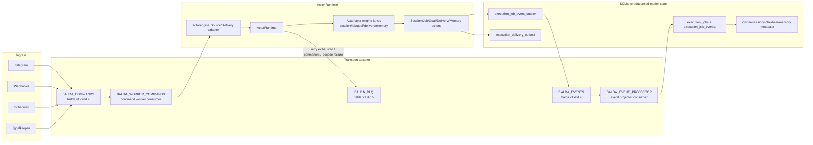

# Balda (V1)

Balda is a self-hosted autonomous engineering worker in team chat.

`balda start` runs the channel-aware background service that binds team chat
sessions to autonomous Balda worker sessions.

Architecture contracts are maintained in:

- `docs/architecture/index.md`

## Summary

- Runtime stack: one or more channel runtimes (Telegram, Zulip, Slack) plus the configured Balda provider runtime.
- Supported channels: Telegram (polling or webhook), Zulip (outgoing webhook), and Slack (HTTP Events API plus slash command receiver).
- Main agent: Balda app key `balda.provider` (profile overrides via `profiles.<profile>.balda.provider`).
- Subagents: one session per channel topic/thread with dedicated git worktree.
- Balda startup prompt includes workspace settings for each session; in git workspace mode it also includes session/base/current-branch context and workspace MCP guidance.
- Output streaming:
  - Progress updates: non-terminal provider progress emits channel progress. Telegram maps this to throttled typing indicators for all chats, plus DM-only thinking placeholders.
  - Final assistant response uses `balda.telegram.formatting_mode` (`rich_markdown|rich_html|none`; default `rich_markdown`; `none` is literal plain text).
- Auth model: one-time owner authorization with startup-generated token.

## User Onboarding Reference

The primary onboarding path runs Balda as a single app with its built-in
command/event runtime and local SQLite state. The runtime is bundled inside the
Balda process by default, so first-time setup does not require operating an
external queue service.

SQLite remains product/read-model state (owner/collaborator, session metadata,
task views, memory state, scheduler metadata, delivery outbox), not a command
queue.

npm remains the shortest install path:

```bash
npm install -g -y @baldaworks/balda
balda init
balda start
```

For repo-local development, run:

```bash
task dev
```

To exercise fake ingress scenarios (Telegram/webhook/scheduler paths), run:

```bash
task scenarios
```

To inspect the runtime streams and consumers, run:

```bash
task runtime-state
```

To replay projection events through the deterministic projector replay suite,
run:

```bash
task projection-replay
```

`balda init` requires a Telegram bot token, detects supported provider CLIs
(`codex`, `opencode`, `copilot`, `gemini`, `claude`), writes
`.config/balda/config.yaml`, initializes `.config/balda/state.db`, and prints
both an owner auth command and Telegram auth link. The default token storage is
CWD `.env` as `BALDA_TELEGRAM_TOKEN`.

Owner onboarding is completed in a direct message with the bot by opening the
printed auth link or sending:

```text
/start owner=<owner_token>
```

After owner auth, users can send normal direct messages to the bot's main DM
session or create a named topic session:

```text
/topic <name>
```

The supported Docker Compose onboarding path uses the shipped root
`Dockerfile` and `compose.yaml`:

```bash
docker compose build balda
docker compose run --rm balda init
docker compose up -d balda
```

The Compose service bind-mounts the current directory as `/workspace`, so the
container uses the same `.env`, `.config/balda/config.yaml`,
`.config/balda/state.db`, and `.git` as host execution.

## Key Internal Package Dependencies

This is a high-level map of Balda-owned internal packages. It is intentionally
selective rather than a full `go list` import dump.

```mermaid
flowchart TB
    balda_root["github.com/baldaworks/balda/internal/apps/balda"]
    agent["github.com/baldaworks/balda/internal/apps/balda/agent"]
    actorcmd["github.com/baldaworks/balda/internal/apps/balda/actorcmd"]
    actors["github.com/baldaworks/balda/internal/apps/balda/actors"]
    auth["github.com/baldaworks/balda/internal/apps/balda/auth"]
    telegram["github.com/baldaworks/balda/internal/apps/balda/channel/telegram"]
    handlers["github.com/baldaworks/balda/internal/apps/balda/handlers"]
    internalmcp["github.com/baldaworks/balda/internal/apps/balda/internalmcp"]
    memory["github.com/baldaworks/balda/internal/apps/balda/memory"]
    session["github.com/baldaworks/balda/internal/apps/balda/session"]
    sessionturn["github.com/baldaworks/balda/internal/apps/balda/sessionturn"]
    state["github.com/baldaworks/balda/internal/apps/balda/state"]
    runtime["github.com/baldaworks/balda/internal/apps/balda/execution"]
    jobs["github.com/baldaworks/balda/internal/apps/balda/jobs"]
    tgbotkit["github.com/baldaworks/balda/internal/apps/balda/tgbotkit"]
    welcome["github.com/baldaworks/balda/internal/apps/balda/welcome"]

    balda_root --> agent
    balda_root --> actors
    balda_root --> actorcmd
    balda_root --> auth
    balda_root --> handlers
    balda_root --> internalmcp
    balda_root --> memory
    balda_root --> state
    balda_root --> runtime
    balda_root --> jobs
    balda_root --> tgbotkit

    actors --> agent
    actors --> telegram
    actors --> session
    actors --> state
    actors --> actorcmd
    actors --> jobs

    telegram --> session

    handlers --> auth
    handlers --> session
    handlers --> commandapp
    handlers --> deliverycmd
    handlers --> turncmd
    handlers --> welcome

    runtime --> actorcmd

    jobs --> actorcmd
    jobs --> state

    sessionturn --> actors
    sessionturn --> memory
    sessionturn --> session

    session --> agent
    session --> state
```



### Dependency Summary

| Package | Import Path | Description | Depends On |
|---------|-------------|-------------|------------|
| `balda` | `internal/apps/balda` | Root application module | actors, agent, auth, handlers, jobs, memory, runtime, state, tgbotkit |
| `actorcmd` | `internal/apps/balda/actorcmd` | Leaf actor targets, namespaces, subjects, headers, and job-scope metadata | `github.com/baldaworks/go-actorlayer` |
| `agent` | `internal/apps/balda/agent` | Provider-backed runtime construction, root runtime prompt/session-state bootstrap, isolated goal runtime preparation, and runtime-adjacent workspace support | `internal/git`, runtime/agent factory packages |
| `actors` | `internal/apps/balda/actors` | Balda product actor behavior | actorcmd, agent, channel, jobs, session, state |
| `auth` | `internal/apps/balda/auth` | Owner authentication store | state (interface) |
| `channel/telegram` | `internal/apps/balda/channel/telegram` | Telegram transport package: adapter, delivery formatting, and message sending | session, `tgbotkit/client` |
| `handlers` | `internal/apps/balda/handlers` | Transport ingress, command publishing, and ingress-side session/control orchestration | auth, commandapp, deliverycmd, session, turncmd, welcome |
| `internalmcp` | `internal/apps/balda/internalmcp` | Bundled MCP server lifecycle | controlmcp, memory, session |
| `memory` | `internal/apps/balda/memory` | Global explicit-fact store and `balda.memory.*` MCP tools | (standalone) |
| `session` | `internal/apps/balda/session` | Session management | agent, state |
| `sessionturn` | `internal/apps/balda/sessionturn` | Queued-turn restoration and execution orchestration | memory, session |
| `sessionturnapp` | `internal/apps/balda/sessionturnapp` | Queued turn execution wiring, provider-turn execution, progress dispatch, and turn-facing adapters | jobs, memory, session, sessionturn, `github.com/baldaworks/go-actorlayer` |
| `state` | `internal/apps/balda/state` | SQLite state persistence | `modernc.org/sqlite`, `updatepoller` |
| `sessionmemory` | `sessionmemory` | Portable session-memory semantic core and canonical contracts | standard library |
| `sessionmemory/app` | `sessionmemory/app` | Portable runtime, typed ingest, recall, trace, forget, and lifecycle ports | `sessionmemory` |
| `sessionmemory/store/badger` | `sessionmemory/store/badger` | Canonical Badger persistence and maintenance | `sessionmemory`, `sessionmemory/app`, Badger |
| `sessionmemory/index/bleve` | `sessionmemory/index/bleve` | Rebuildable lexical projection | `sessionmemory`, `sessionmemory/app`, Bleve |
| `sessionmemory/mcp` | `sessionmemory/mcp` | Neutral `session_memory.search` and `session_memory.trace` adapter | `sessionmemory`, MCP SDK |
| `sessionmemoryapp` | `internal/apps/balda/sessionmemoryapp` | Balda capture, redaction, ingress outbox, worker, and host adapters | public session-memory packages, Balda transport ports |
| `sessionmemorymcp` | `internal/apps/balda/sessionmemorymcp` | Authenticated broker/context bridge for neutral MCP | Balda session/locator contracts |
| `runtime` | `internal/apps/balda/execution` | Actor runtime host, lane policy, retry/dead-letter policy, and delivery wrapping | actorcmd, `github.com/baldaworks/go-actorlayer` |
| `jobs` | `internal/apps/balda/jobs` | Durable job service, transactional event outbox, and read-model projection | actorcmd, state, `github.com/baldaworks/go-actorlayer` |
| `tgbotkit` | `internal/apps/balda/tgbotkit` | Telegram bot runtime | `tgbotkit/*` |
| `welcome` | `internal/apps/balda/welcome` | Welcome message builder | (standalone) |

## Actorlayer Boundary

Balda treats `actorlayer` as the reusable actor library boundary and never as product policy.

## Architecture Layers

- `github.com/baldaworks/go-actorlayer`: generic actor library only. It owns envelopes, addressing, lane execution primitives, retry/error helpers, and transport-facing contracts. It does not own Balda product policy.
- `internal/apps/balda/actorcmd`: stable leaf package for product wire taxonomy. It owns actor targets, namespaces, kinds, subjects, headers, and job-scope metadata.
- `internal/apps/balda/execution`: Balda runtime policy. It owns the host loop, lane policy, dead-letter handling, heartbeat policy, and runtime-facing transport wiring.
- `internal/apps/balda/agent`: provider-backed runtime support. It owns root runtime construction, prompt/session-state bootstrap, isolated goal runtime preparation, and runtime-adjacent workspace support. It does not own session lifecycle semantics.
- `internal/apps/balda/jobs`: durable job orchestration state and event projection. It owns job records, job events, and read-model updates, but it does not own transport execution.
- `internal/apps/balda/actors`: product actors. It owns session, job, goalkeeper, delivery, control, and memory behavior.
- `internal/apps/balda/sessionturn`: queued-turn restoration behind a narrow executor port.
- `internal/apps/balda/sessionturnapp`: queued turn execution wiring, provider execution, progress dispatch, and turn-specific adapters.
- `internal/apps/balda/internalmcp`: bundled MCP construction and lifecycle.
- `internal/apps/balda/handlers`: transport ingress only. It normalizes Telegram/Slack/Zulip/webhook/scheduler input, checks auth/session rules, and publishes actor work. It must not own product actors, provider-turn execution, or delivery policy.
- `internal/apps/balda/handlersfx`: composition-root adapters that bind handler-owned ports to concrete provider runtimes without moving ingress policy into wiring.
- `internal/apps/balda/channel/*`: concrete channel delivery semantics. They adapt provider-specific messaging APIs behind Balda delivery commands.
- `internal/apps/balda/state`: SQLite-backed product state and read models. It owns sessions, scheduler state, job tables, delivery idempotency, and the session-memory ingress outbox/audit records. It does not own canonical session-memory domain state.
- `internal/apps/balda/memory`: separate global explicit-fact memory (`balda.memory.read`, `balda.memory.remember`, and `MEMORY.md` import). It is not the session-memory subsystem.
- `sessionmemory` and `sessionmemory/app`: portable semantic ownership and capability orchestration for exact-scope session memory.
- `sessionmemory/store/badger`: canonical session-memory state; `sessionmemory/index/bleve`: rebuildable lexical projection.
- `sessionmemory/mcp`: neutral search/trace tools; Balda's `sessionmemorymcp` supplies authenticated scope context and no transport locator is accepted from tool input.

- `balda.provider` selects one app-scoped provider runtime for all Balda sessions and `/goalkeeper` worker-validator runs in the process. `/goalkeeper` still creates isolated worker/validator ADK sessions and workspace state, but it reuses the same provider runtime/client ownership as normal session turns.
- Actorlayer owns generic actor mechanics: registration, addressing, envelopes, retry/error helpers, lane execution, lifecycle state, and transport-facing contracts.
- Balda owns product actors and product behavior implemented as actors: session turns, job routing, goal execution, delivery, control, and memory.
- Balda exposes its durable transport to product/runtime code only as actorlayer source, delivery, and dispatch abstractions; the concrete transport stays inside the NATS adapter.

The boundary is intentionally explicit:

- Balda owns retry, dead-letter, queue visibility, and job projection policy.
- Actor command contracts expose only actor-level contracts and metadata (`chat_id`, `topic_id`, `goal_id`, `attempt`).
- Runtime command flow and projectors are preserved by keeping queue/provider details outside actor definitions.

### Migration Checklist

- Keep Balda product actor definitions in `internal/apps/balda/actors`; keep ingress/Telegram command handling in `internal/apps/balda/handlers`.
- Keep actor definitions and state types independent from provider IDs.
- Ensure no provider or queue API types enter the actor layer contract.
- Keep retry/dead-letter policy, projection writes, and reporting in Balda-owned modules.
- Preserve command envelope metadata (`chat_id`, `topic_id`, `goal_id`) at the actorlayer boundary.
- Verify job/actor scenarios through the configured `balda.provider` runtime and actorlayer dispatch path.

### Implementation Map

Balda's actorlayer integration is intentionally direct:

- `internal/apps/balda/execution/host.go`: consumes an `actorlayer/engine.Source` and owns actor lane execution.
- `internal/apps/balda/actors`: defines Balda product actors for session, job, goal, delivery, control, and memory command contracts.
- `internal/apps/balda/handlers`: owns ingress normalization, command parsing, precondition checks, and durable actor-command publication.
- `internal/apps/balda/handlersfx`: binds handler-owned ports to concrete provider runtimes at the composition root.
- `internal/apps/balda/sessionturn`: owns queued session restore/create and delegates the provider iteration to the executor adapter.
- `internal/apps/balda/actorcmd`: owns product command/event wire constants shared by actors, runtime, jobs, and ingress.
- `internal/apps/balda/eventbus/nats`: adapts transport publish, fetch, ack, retry, in-progress heartbeat, terminal dead-letter, and event-stream publishing into actorlayer source/delivery/dispatch contracts.
- `internal/apps/balda/agent`: owns the single app-scoped provider runtime selected by `balda.provider`, root runtime construction, isolated goal runtime preparation, and runtime-adjacent workspace support.
- `internal/apps/balda/session`: owns per-session lifecycle state, restore/ensure semantics, and runtime/session binding.
- `internal/apps/balda/state`: owns SQLite product/read-model state for sessions, jobs, projections, global-memory KV, delivery outbox rows, and session-memory ingress/audit rows. Canonical session-memory records live in the public Badger adapter.
- `sessionmemory/app` and `internal/apps/balda/sessionmemoryapp`: own typed semantic processing versus Balda capture/redaction/outbox/worker wiring respectively.

Do not add extra Balda-local actor adapter packages or execution/delivery selector
layers around the runtime. The generic actor runtime lives in `github.com/baldaworks/go-actorlayer`,
and Balda keeps product policy in Balda.

## Startup Order (Required)

Balda startup order is strict:

1. Load runtime + Balda config, then construct and validate the immutable delivery-format registry.
2. Start internal MCP lifecycle manager.
3. Start the enabled portable session-memory runtime (canonical Badger, Bleve projection, and model lifecycle).
4. Start Balda provider runtime via `RuntimeManager.EnsureRuntime(...)`.
5. Start session/mailbox and durable actor infrastructure: event projector, job-event outbox publisher, and actor host.
6. Bootstrap Telegram owner state, then start scheduler, inbound webhooks, Zulip, Slack, and Telegram ingress.

One composition-root coordinator owns this order. Configuration or registry
errors fail before any ingress stage can become ready. Shutdown runs the same
stages in reverse, so ingress stops before actor/provider/MCP resources.

Internal MCP v1 scope is config + lifecycle plumbing; server implementations can be added incrementally.

## Configuration

Balda config is loaded from one selected file (priority order):

1. Embedded defaults (`cmd/balda/balda.yaml`)
2. Runtime config in `.config/balda/config.yaml`
3. Profile app overrides in the same file (`profiles.<name>.balda.*`)
4. Environment variables (`BALDA_*`) via Viper env mapping

Balda also auto-loads a `.env` file at startup (via `godotenv`) from the Balda process working directory only. Values loaded from `.env` are treated as environment variables, so `BALDA_*` entries override file config the same way as exported shell variables.
The selected config file is env-expanded before YAML parsing, so both `$VAR` and `${VAR}` placeholders work anywhere in that file. For `runtime.mcp_servers.<id>` entries with `type: stdio`, the launched MCP process inherits Balda's full process environment by default, and `env` overrides individual variables.

Example `.env`:

```dotenv
BALDA_TELEGRAM_TOKEN=123456:ABCDEF
BALDA_TELEGRAM_FORMATTING_MODE=rich_markdown
BALDA_TELEGRAM_WEBHOOK_ENABLED=true
BALDA_TELEGRAM_WEBHOOK_URL=https://example.com/telegram/webhook
```

Slack deployments use plain HTTP inside Balda. Public HTTPS Request URLs,
certificates, reverse proxies, ingress, and tunnels are deployment
infrastructure outside Balda. Forward Slack Events API traffic to
`balda.slack.events_path` and Slack slash command traffic to
`balda.slack.commands_path`.

Config shape:

```yaml
runtime:
  providers:
    <provider_id>:
      type: <provider_type>
  mcp_servers: {}
balda:
  provider: <provider_id>
  session_memory:
    enabled: true
    provider: ""  # optional extraction provider; empty falls back to balda.provider
  telegram:
    token: ""
    formatting_mode: "rich_markdown"
profiles:
  <profile>:
    balda:
      provider: <provider_id>
```

### Docker Compose Runtime

Balda ships a maintained root `Dockerfile` and `compose.yaml` for local Docker
Compose runtime. This path is the local workspace-oriented runtime: Compose
builds the image from the root Dockerfile and mounts the current project
directory as the runtime workspace.

The `Dockerfile` uses a Node Bookworm runtime with the common tools Balda needs:

```dockerfile
ARG NODE_IMAGE=node:24-bookworm
FROM ${NODE_IMAGE}

RUN apt-get update \
 && apt-get install -y --no-install-recommends \
      ca-certificates \
      curl \
      git \
      openssh-client \
      ripgrep \
 && rm -rf /var/lib/apt/lists/*

RUN npm install -g \
      @baldaworks/balda \
      @openai/codex \
      opencode-ai \
      @google/gemini-cli \
      @anthropic-ai/claude-code \
      @github/copilot \
 && npm cache clean --force

RUN command -v balda \
 && command -v codex \
 && command -v opencode \
 && command -v gemini \
 && command -v claude \
 && command -v copilot

USER node

WORKDIR /workspace
ENTRYPOINT ["balda"]
```

The `compose.yaml` uses a current-directory bind mount:

```yaml
services:
  balda:
    build: .
    working_dir: /workspace
    volumes:
      - .:/workspace
      - balda-home:/home/node
    command: start

volumes:
  balda-home:
```

With `.:/workspace`, Balda resolves the default runtime paths inside the mounted
project:

- `.env` is loaded from `/workspace/.env`.
- `.config/balda/config.yaml` remains the selected app config.
- `.config/balda/state.db` persists owner auth, session metadata, task
  read-model state, MCP KV, durable memory, and Telegram polling offsets on the host.
- Existing `.config/balda/MEMORY.md` content is imported into state DB memory once
  when `balda.memory.enabled=true` and KV memory is empty.
- `.git` stays visible to `balda.workspace.mode=auto|on`, so workspace mode sees
  the same repository as host execution.
- `balda-home` persists provider CLI auth/config written under `/home/node`.

Balda auto-loads `/workspace/.env`. `env_file: .env` is optional after the file
exists, but should not be required for the first `docker compose run --rm balda init`.

The container image bundles Balda plus every provider CLI detected by
`balda init`: `codex`, `opencode`, `copilot`, `gemini`, and `claude`. Claude
Code is detected through the real `claude` binary; `claudecode` is not a
supported binary name. Provider credentials are not baked into the image.
Authenticate through provider environment variables or by running provider login
commands through Compose. If you need fully repeatable builds, pin `NODE_IMAGE`
to a digest or concrete supported Bookworm tag, and pin the Dockerfile package
build args to exact npm versions: `BALDA_NPM_PACKAGE`, `CODEX_NPM_PACKAGE`,
`OPENCODE_NPM_PACKAGE`, `GEMINI_NPM_PACKAGE`, `CLAUDE_CODE_NPM_PACKAGE`, and
`COPILOT_NPM_PACKAGE`.

### Published GHCR Image

Balda also publishes an official container image at
`ghcr.io/baldaworks/balda:latest`. Unlike the local Compose Dockerfile, the
published image is built from the tagged source tree with
`Dockerfile.release`, so the Balda binary comes from the release commit rather
than from the npm package.

The published GHCR image is intentionally minimal. It contains only the
`/usr/local/bin/balda` binary and an absolute Balda entrypoint. It does not
bundle provider CLIs such as `codex`, `opencode`, `copilot`, `gemini`, or
`claude`, and it is not the documented all-in-one runtime equivalent of local
Compose.

Treat `ghcr.io/baldaworks/balda:latest` as a source stage for downstream bot
images. Copy `balda` from it, then add exactly the provider CLI runtime you
want in your own final image. A concrete Codex example:

```dockerfile
FROM node:24-bookworm-slim AS cli-builder
RUN npm install -g @openai/codex

FROM ghcr.io/baldaworks/balda:latest AS balda

FROM node:24-bookworm-slim
RUN apt-get update \
 && apt-get install -y --no-install-recommends \
      ca-certificates \
      git \
      openssh-client \
      ripgrep \
 && rm -rf /var/lib/apt/lists/*

COPY --from=cli-builder /usr/local/lib/node_modules /usr/local/lib/node_modules
COPY --from=cli-builder /usr/local/bin/codex /usr/local/bin/codex
COPY --from=balda /usr/local/bin/balda /usr/local/bin/balda

WORKDIR /workspace
ENTRYPOINT ["balda"]
```

In that pattern, your final runtime image owns provider auth, provider
environment variables, any extra system packages, and any persisted home
directory layout required by the selected CLI.

For the bundled local runtime flow, keep using the root `Dockerfile` and
`compose.yaml`. That Compose path still mounts the host checkout into
`/workspace`, keeps `.env`, `.config/balda/config.yaml`,
`.config/balda/state.db`, and `.git` on the host, and persists provider CLI
auth/config in the named `balda-home` volume.

The published image is released from Git tags through `release.yml` and is
currently tagged only as `latest`. OCI labels still record the release tag,
commit SHA, source repository, and build timestamp.

Polling mode is the default and does not require a published port. Webhook mode
requires `balda.telegram.webhook.enabled=true`,
`balda.telegram.webhook.url=https://.../telegram/webhook`, and a published local
listener such as `8080:8080`; TLS and public routing should be handled outside
the Balda process.

### MCP Server Configuration

MCP servers are configured in `runtime.mcp_servers` and referenced by providers via `runtime.providers.<id>.mcp_servers`.

#### Transport Types

| Type | Description |
|------|-------------|
| `stdio` | Process-based stdio communication (recommended for local tools) |
| `http` | HTTP transport with SSE streaming |
| `sse` | Server-Sent Events transport |

#### Stdio MCP Server Example

```yaml
runtime:
  mcp_servers:
    # Local Python tool server
    python-tools:
      type: stdio
      cmd: ["uv", "run", "mcp", "run", "path/to/server.py"]
      env:
        API_KEY: "${PYTHON_TOOLS_API_KEY}"
      working_dir: /path/to/project

    # Node.js based MCP server
    node-tools:
      type: stdio
      cmd: ["npx", "-y", "@modelcontextprotocol/server-filesystem", "/tmp"]
      env:
        DEBUG: "true"
```

#### HTTP MCP Server Example

```yaml
runtime:
  mcp_servers:
    remote-mcp:
      type: http
      url: https://mcp.example.com/mcp
      headers:
        Authorization: "Bearer ${MCP_TOKEN}"
```

#### Knowl sidecar

Knowl is integrated as an ordinary external MCP server. Start and configure the
Knowl service separately, including its workspace, storage, provider, and
listener:

```yaml
runtime:
  mcp_servers:
    knowl:
      type: http
      url: http://127.0.0.1:8080/mcp

balda:
  mcp_servers:
    - knowl
```

The server ID and tools retain Knowl naming: `knowl`, `knowl_retrieve`,
`knowl_ingest`, and `knowl_operation`. Balda does not embed or supervise
Knowl, initialize its workspace, or own its provider and persistence. There is
no automatic turn or memory ingestion; content enters Knowl only through an
explicit tool call or another operator-controlled ingest path.

#### Using MCP Servers in Providers

```yaml
runtime:
  mcp_servers:
    python-tools:
      type: stdio
      cmd: ["uv", "run", "mcp", "run", "server.py"]

  providers:
    codex:
      type: codex_acp
      codex_acp:
        reasoning_effort: high
      mcp_servers:
        - python-tools

balda:
  provider: codex
  mcp_servers: []  # extra servers added to all sessions
```

#### Bundled Balda MCP Server

The balda MCP server (`balda`) is automatically included in all sessions. It provides:

- `balda.state` - persistent key-value storage
- `balda.memory.read` - read durable memory from `state.db` when `balda.memory.enabled=true`
- `balda.memory.remember` - append a durable fact to `state.db` memory when `balda.memory.enabled=true`
- `balda.workspace.import` - import workspace from base branch
- `balda.workspace.export` - export workspace to base branch

`balda.memory.remember` is for explicit user requests such as "remember this".
It updates durable memory and its latest-update timestamp immediately. New
sessions start with the complete current memory plus its version and timestamp.
Before each active or restored session turn invokes the provider, Balda compares
the timestamp carried by that turn (falling back to runtime session state) with
one current memory snapshot. A missing or different timestamp refreshes session
state and prepends the complete current global-memory snapshot to that same user
prompt inside an `[application-memory]` block. The block identifies remembered
text as durable context data, not a new user command. An equal timestamp, empty
memory, or disabled memory leaves the user prompt unchanged. The global fact
store is expected to remain small, so changed turns inject the full snapshot,
not only facts written since the previous timestamp.

### Agent permission review

- `balda.permissions.mode`: `allow_all`, `ask`, or `deny_all` (default `allow_all`)
- `balda.permissions.timeout`: maximum time to wait for a reply in `ask` mode
  (default `2m`)

Environment overrides are `BALDA_PERMISSIONS_MODE` and
`BALDA_PERMISSIONS_TIMEOUT`. `allow_all` is retained for backward
compatibility, but it grants every agent request using an allow option and should
only be used for trusted agents. `ask` sends a redacted permission prompt to
the initiating user on Telegram or Slackagent. Replies can use the displayed
number, exact option ID, or option name. Unknown channels, another user's
reply, timeout, cancellation, or missing interaction context never grant the
request.

Example:

```yaml
balda:
  permissions:
    mode: ask
    timeout: 2m
```

### Telegram settings

- `balda.telegram.token`: bot token (required)
  - `balda init` validates token via Telegram API and can store it either in:
    - CWD `.env` as `BALDA_TELEGRAM_TOKEN` (default)
    - balda config file key `balda.telegram.token`
  - when `.env` storage is selected, existing `.env` content is preserved and `BALDA_TELEGRAM_TOKEN` is upserted
- `balda.telegram.formatting_mode`: final assistant response format mode.
  - allowed values: `rich_markdown`, `rich_html`, `none`
  - default: `rich_markdown`
  - `rich_markdown` accepts Markdown/plain text from the model and sends it with Telegram rich messages
  - `rich_html` accepts rich-message HTML from the model and sends it with Telegram rich messages
  - `none` sends literal plain text without Telegram `parse_mode`
  - invalid values fail startup
  - migration is a hard cut: replace an older `markdownv2` value with `rich_markdown` (or `none`) and an older `html` value with `rich_html` (or `none`); no compatibility aliases are accepted
  - before a mixed-version upgrade, stop old ingress and drain pending actor commands so old delivery payloads do not cross the format-contract boundary
  - see [Telegram Message Formatting](telegram-formatting.md) for supported tags, unsupported tags, and escaping behavior
- `balda.telegram.plan_updates`: control visibility of work-plan progress in Telegram (default: `true`)
  - `true`: DM chats replace generic thinking placeholders with plan snapshots when the provider emits plan updates
  - `true`: public chats/topics send a plain-text message for each distinct plan snapshot
  - `false`: plan progress remains hidden; Balda still emits progress activity, sends typing indicators, and keeps DM thinking drafts instead of plan snapshots
- `balda.telegram.webhook.enabled`: enable local HTTP webhook endpoint (`true` => webhook mode, `false` => polling mode; default: `false`)
- `balda.telegram.webhook.url`: outgoing Telegram webhook URL (required when `balda.telegram.webhook.enabled=true`)
- `balda.telegram.webhook.auth_token`: webhook auth token required when `balda.telegram.webhook.enabled=true`; Telegram sends it as `X-Telegram-Bot-Api-Secret-Token`
- `balda.telegram.webhook.listen_addr`: local webhook listen address (default: `0.0.0.0:8080`)
- `balda.telegram.webhook.path`: local webhook path (default: `/telegram/webhook`)
- Telegram polling holds the persisted update offset until the provider event
  has completed runtime settlement. Accepted and terminal events advance the
  offset; retryable handler failures leave it unchanged so Telegram replays the
  same update ID. Polling retries are bounded and then become terminal to avoid
  a poison-update loop. Webhook delivery keeps its existing request settlement
  and does not use the polling offset gate.
- `balda.zulip.bot_email`: Zulip outgoing webhook bot email (required when `balda.zulip.webhook.enabled=true`; env: `BALDA_ZULIP_BOT_EMAIL`)
- `balda.zulip.api_key`: Zulip bot API key used for REST replies (required when `balda.zulip.webhook.enabled=true`; env: `BALDA_ZULIP_API_KEY`)
- `balda.zulip.server_url`: Zulip server base URL, absolute `http://` or `https://` (required when `balda.zulip.webhook.enabled=true`; env: `BALDA_ZULIP_SERVER_URL`)
- `balda.zulip.webhook_token`: Zulip outgoing webhook token that must match the incoming payload token (required when `balda.zulip.webhook.enabled=true`; env: `BALDA_ZULIP_WEBHOOK_TOKEN`)
- `balda.zulip.webhook.enabled`: enable local Zulip outgoing webhook receiver (`true` => Zulip channel enabled; default: `false`; env: `BALDA_ZULIP_WEBHOOK_ENABLED`)
- `balda.zulip.webhook.listen_addr`: local Zulip webhook listen address (default: `0.0.0.0:8090`; env: `BALDA_ZULIP_WEBHOOK_LISTEN_ADDR`)
- `balda.zulip.webhook.path`: local Zulip webhook path, which must start with `/` (default: `/zulip/webhook`; env: `BALDA_ZULIP_WEBHOOK_PATH`)
- `balda.slack.enabled`: enable local Slack HTTP receiver (`true` => Slack channel enabled; default: `false`; env: `BALDA_SLACK_ENABLED`)
- `balda.slack.bot_token`: Slack bot token used for `auth.test` and replies (required when Slack is enabled; env: `BALDA_SLACK_BOT_TOKEN`)
- `balda.slack.signing_secret`: Slack signing secret used for request verification (required when Slack is enabled; env: `BALDA_SLACK_SIGNING_SECRET`)
- `balda.slack.listen_addr`: local Slack HTTP listen address (default: `0.0.0.0:8091`; env: `BALDA_SLACK_LISTEN_ADDR`)
- `balda.slack.events_path`: local Slack Events API path, must start with `/` (default: `/slack/events`; env: `BALDA_SLACK_EVENTS_PATH`)
- `balda.slack.commands_path`: local Slack slash command path, must start with `/` (default: `/slack/commands`; env: `BALDA_SLACK_COMMANDS_PATH`)
- `balda.slack.include_private_channels`: process private channel events when the app has `groups:history` (default: `false`)
- `balda.webhooks.enabled`: enable generic inbound webhook receiver (default: `false`)
- `balda.webhooks.listen_addr`: local inbound webhook listen address (default: `127.0.0.1:8090`)
- `balda.webhooks.routes`: route table keyed by route name
  - required when `balda.webhooks.enabled=true`
  - each route requires:
    - `path`: local inbound webhook path (for example `/webhook/release`)
    - `prompt_template`: Go `text/template` rendered with `RequestID`, `Path`, `Method`, `RawBody`, and `Headers`
  - optional `envelope`:
    - `target` + `key`: destination address (defaults to `alias` + `owner`)
      - `target=locator` consumes a locator ref in the form `<channel_type>:<address_key>`; `/locator` prints the current session value
    - `mode`: `task` (default) or `session`
    - `report_to`: optional destination for progress/final replies
  - optional `auth`:
    - `type`: `none` (default) or `header`
    - `header` + `value` (or `secret_env`) for `type=header`
  - optional `dedupe`:
    - `source`: `request_id` (default), `header`, or `body_sha256`
    - `header` required for `source=header`

### Attachment prompt representation

Telegram documents, photos, and voice messages are persisted under
`balda.state_dir` before the provider turn. For every non-empty regular file
with a preserved or detected MIME type, Balda supplies an ADK `FileData` part
with an absolute, escaped `file://` URI and the persisted display name.
Metadata remains an adjacent text part and does not replace a valid file
reference.

The ACP adapter maps every persisted `FileData` to baseline `ResourceLink`,
regardless of the server's optional image/audio capabilities. Native `Image`
and `Audio` blocks are reserved for inline bytes; `ResourceLink` does not
require a separate capability flag. Balda does not inline-read or size-limit
persisted files for this conversion, and it does not create temporary files.
Missing or empty blobs retain the deterministic metadata fallback; unreadable
or non-regular paths return a stable build error.

### Balda settings

- `balda.working_dir`: optional balda working directory (defaults to process CWD)
- `balda.state_dir`: balda state directory for persistent balda SQLite state (`state.db`).
  - Stores owner/app KV, `balda.state` MCP KV, session metadata, job/read-model state, optional session history, and Telegram polling offset.
  - Schema is migration-versioned and auto-applied on startup.
  - Relative paths are resolved from `balda.working_dir`.
  - Default: `.config/balda`
- `balda.sessions.persistence`: `sqlite|memory` (default `sqlite`)
  - `sqlite`: session history and state are persisted in `state.db` and reused after restart until the session is explicitly closed.
  - `memory`: conversation/runtime state is process-local; only Balda metadata is persisted.
- `balda.memory.enabled`: enable internal durable memory (default `true`)
  - when disabled, Balda does not snapshot durable memory or register `balda.memory.*` MCP tools.
- `balda.session_memory`: optional durable conversation-memory integration (default disabled)
  - `enabled`: starts the serialized JetStream consumer and enables the neutral locator-scoped `session_memory.search` and `session_memory.trace` tools.
  - `provider`: optional ID from `runtime.providers` for isolated extraction; empty falls back to `balda.provider` while enabled.
  - `derivation.timeout` / `derivation.max_output_bytes`: bounds the isolated Norma derivation runtime.
  - completed text-only turns and session reset/close/rotation/shutdown boundaries are published to the dedicated `BALDA_SESSION_MEMORY` stream.
  - `stream` / `consumer`, timeout, retry, and retention fields are validated and must not collide with command/event/DLQ names.
  - search is bound to the authenticated current locator; personal and group
    audiences, including their topics/threads, are classified by concrete
    channel codecs, while the exact `<channel_type>:<address_key>` remains the
    isolation key.
  - recalled text is returned as untrusted reference data and is never treated as instructions or commands.
- `balda.goal.max_iterations`: maximum `/goalkeeper` worker-validator loop iterations (default `25`)
  - invalid values are clamped to `25`.
- `runtime.providers.<provider_id>.codex_acp.reasoning_effort`: optional Codex reasoning effort.
  - allowed values: `minimal`, `low`, `medium`, `high`, `xhigh`
  - Balda passes the selected provider's value through to the isolated session-memory runtime (or chat runtime for `balda.provider`); it is not inherited across providers.
- `balda.nats.embedded`: run Balda-owned NATS inside the process (default `true`)
- `balda.nats.host` / `port`: embedded listener address (default `127.0.0.1:-1`, random local port)
- embedded NATS transport files live under `${balda.state_dir}/nats`
- `balda.nats.max_memory` / `max_store`: embedded runtime resource caps (defaults `256mb` and `2gb`)
- `balda.runtime`: optional advanced runtime tuning for command handling, retries, backpressure, and failure retention. Most installs should leave it at defaults.
- `/goalkeeper` runs repeated work and validation passes in isolated GoalKeeper worker/validator ADK sessions until the goal passes validation or `balda.goal.max_iterations` is reached.
  - with workspace mode enabled, `/goalkeeper` uses a separate goal worktree and exports passing work to `balda.workspace.base_branch`.
  - with workspace mode disabled, `/goalkeeper` works directly in `balda.working_dir` and records `not_exported` on passing runs.
- internal durable memory uses app KV in `${balda.state_dir}/state.db` when `balda.memory.enabled=true`
  - `balda.memory.read` reads memory from MCP.
  - `balda.memory.remember` appends facts from MCP.
  - every write advances the latest-memory timestamp.
  - on the next turn after a write, active or restored sessions inject the
    complete current snapshot into the provider user prompt and advance the
    turn/session timestamp boundary; unchanged timestamps do not inject memory.
  - existing `${balda.state_dir}/MEMORY.md` content is imported once when KV memory is empty.
- owner auth token is generated during `balda init`, persisted in `state.db`, and reused by `balda start`
  - if token is missing in existing state, `balda start` backfills one-time and persists it
  - if no owner is registered yet, `balda start` logs the owner bootstrap command and auth link again to help finish first-time onboarding
  - after the first successful owner auth, normal startup logs go back to bot identity only and no longer expose owner auth tokens or auth links
  - if an owner is already registered, `balda start` fails fast when the owner session cannot be restored or created
- bundled balda MCP listener always binds to local ephemeral address (`127.0.0.1:0`)
  - bundled routes on this listener:
    - `/mcp/balda` for the built-in balda MCP server
- Balda config is edited via the config file itself, not through MCP.
  - balda agents should use the config path shown in the system instruction and edit `.config/balda/config.yaml` directly
- `balda.mcp_servers`: extra MCP server IDs for all balda-started sessions (must reference IDs declared in `runtime.mcp_servers`)
  - effective MCP IDs = bundled defaults + `runtime.providers.<provider_id>.mcp_servers` + `balda.mcp_servers` (deduplicated)
- `balda.global_instruction`: optional balda-wide global instruction applied to all sessions
  - value: global instruction text included in balda prompt for all agents
  - effective balda instruction order: built-in balda instructions + `balda.global_instruction` + `runtime.providers.<provider_id>.system_instructions`
  - `balda init` generates a channel-aware example prompt
- `balda.workspace.mode`: `on|off|auto` (default `auto`)
  - `on`: always use Git worktrees per session; startup fails if `working_dir` is not a Git repository
  - `off`: run agents directly in balda `working_dir` (no `balda.workspace` namespace)
  - `auto`: enable worktrees only when `working_dir` is a Git repo, otherwise fallback to `off`
- `balda.workspace.base_branch`: base branch used for workspace sync/export (for example `main`, `master`, `develop`)
  - `balda init` detects current HEAD branch and writes it when available
  - if empty, balda resolves base branch from current HEAD at startup
  - `balda.workspace.export` requires main repo to be on this branch
- `balda.workspace.sessions_dir`: directory name under `balda.state_dir` used for per-session worktrees
  - defaults to `sessions`
- Balda auto-starts only its built-in `balda` MCP server. Any additional MCP
  servers must be declared explicitly through `runtime.mcp_servers`,
  provider-level `mcp_servers`, or `balda.mcp_servers`.

## Durable session memory

`balda.session_memory` is an optional episodic-memory integration. It is not a
replacement for the existing fact store: `balda.memory.read` and
`balda.memory.remember` remain global-per-instance KV operations in
`${balda.state_dir}/state.db`. Session memory sends eligible conversation text
through `sessionmemory/app` to the public canonical Badger adapter and recalls
it through a rebuildable Bleve projection only on demand. This is an in-process
extraction boundary, not a remote service.

Session-memory backend state is grouped below `balda.state_dir`:

```text
${balda.state_dir}/session-memory/
├── badger/       # authoritative canonical state
└── bleve/        # rebuildable search projection
```

The canonical Badger path is authoritative and remains stable across restart.
On upgrade, the old direct-child paths
`${balda.state_dir}/session-memory.badger` and
`${balda.state_dir}/session-memory-bleve` are relocated into this subtree
before session memory opens. The local move is idempotent and preserves
canonical data; an old/new path conflict fails closed rather than silently
shadowing data. If no canonical path exists, enabled session memory starts
empty. The removed SQLite session-memory domain tables are not imported;
migration `00033` drops those six legacy tables while preserving the ingress
outbox and audit tables from migrations `00030`–`00032`. The migration `Down`
section recreates an empty legacy schema, but dropped rows cannot be recovered.

### Enablement and configuration

The feature is disabled unless `balda.session_memory.enabled=true`. Disabled
mode is deliberately inert: malformed optional memory values are ignored,
no memory stream or consumer is created, and
the existing fact-memory/session-restore path is unchanged.

The smallest enabled configuration is:

```yaml
balda:
  session_memory:
    enabled: true
    # Empty uses balda.provider; set memory_fast as shown below for a separate model.
    provider: ""
    trusted_tools:
      - calendar.lookup
    derivation:
      timeout: 30s
      max_output_bytes: 262144
    stream: BALDA_SESSION_MEMORY
    consumer: BALDA_SESSION_MEMORY_WORKER
```

All `balda.session_memory.*` keys also accept the corresponding
`BALDA_SESSION_MEMORY_*` environment override (nested keys use underscores).

`balda.session_memory.provider` references an entry in `runtime.providers` and
controls only the isolated fact/semantic extraction runtime. `balda.provider`
continues to own chat and GoalKeeper. If the session-memory selector is empty,
enabled memory uses `balda.provider` for backwards compatibility; if both are
empty, startup fails. The selected provider's existing `model` and
`reasoning_effort` settings are applied without copying chat settings. Omit
`reasoning_effort` to make no explicit reasoning request. Resolution and
provider schema/factory validation are local and structural; the provider
process remains lazy and no remote probe is performed.

Example with a cheaper extraction model and no explicit reasoning:

```yaml
runtime:
  providers:
    codex:
      type: codex_acp
      codex_acp: {}
    memory_fast:
      type: codex_acp
      codex_acp:
        model: gpt-5-mini
        # reasoning_effort intentionally omitted

balda:
  provider: codex
  session_memory:
    enabled: true
    provider: memory_fast
```

The shipped example in `cmd/balda/balda.yaml` lists every default. The enabled
defaults are:

| Key | Default | Meaning |
|---|---:|---|
| `derivation.timeout` / `derivation.max_output_bytes` | `30s` / `262144` | Bounded isolated Norma derivation call and output. |
| `stream` / `consumer` | `BALDA_SESSION_MEMORY` / `BALDA_SESSION_MEMORY_WORKER` | Dedicated JetStream names; collisions with command/event/DLQ names fail startup. |
| `ack_wait` / `fetch_wait` | `5m` / `1s` | JetStream acknowledgement deadline and worker fetch wait. |
| `publish_timeout` / `publish_attempts` | `2s` / `3` | Bounded pre-PubAck handoff retry. |
| `max_age` / `max_bytes` / `max_msg_size` | `7d` / `-1` / `-1` | Stream retention; `-1` means unlimited for byte/message limits. |
| `max_concurrent_scopes` / `max_queued_per_scope` | `4` / `32` | Maximum independent provider lanes and unresolved exports buffered per exact scope. |
| `search_timeout` | `5s` | MCP search deadline. |
| `retry.max_attempts` | `5` | Worker attempts per export before DLQ. |
| `retry.base_delay` / `max_delay` | `250ms` / `5s` | Exponential retry delay bounds. |
| `retry.progress_interval` | `30s` | `InProgress` heartbeat while native derivation or retry is running. |
| `retry.fetch_error_delay` | `100ms` | Delay after a transport fetch error. |
| `retry.shutdown_timeout` | `30s` | Maximum worker drain/close interval. |

Enabled mode validates derivation bounds and stream/consumer identifiers.
Values are parsed before the runtime starts, so an invalid enabled
configuration fails fast rather than silently disabling export. No provider
URL, token, or external HTTP service is required.

### What is exported and how scopes split

After ADK emits `TurnComplete`, Balda exports one completed turn only when it
has non-empty visible user text and final visible assistant text. Thought
parts, tool calls/results, binary parts, partial responses, and interrupted or
non-completed turns are excluded. The export contains the stable Balda session
identity, current provider-session identity, optional lineage, source turn ID,
completion time, and the two text messages. A native processor failure is logged as a
bounded diagnostic and does not suppress the already completed user-facing
reply.

The exact canonical locator string, produced by `locatorref`, is the canonical
Badger partition and authorization key:

```text
<channel_type>:<address_key>
```

The scope kind (`personal` or `group`) is metadata classified by the concrete
channel codec; it never replaces the exact key. A personal root locator,
personal-topic locator, group locator, and group-topic locator are separate
partitions. Topic identity is orthogonal to audience. There is no
owner, collaborator, channel-type, chat-ID, or topic inheritance, and no
cross-scope fallback. Ambiguous or unsupported locator classification fails
closed. Group conversation text is sent only to the exact group locator's
trusted canonical scope.

Session reset, close, rotation, and bounded application shutdown also publish a
boundary export with the old session identity before that identity is removed
or rebound. Boundary order follows completed-turn order, so a later session
cannot overtake an unresolved earlier export.

### Search and trace MCP contract

When enabled, the bundled MCP server registers
`session_memory.search` and `session_memory.trace`. Search input
keeps the original query/limit contract and accepts additive filters:

```json
{"query":"release checklist","limit":10,"memory_kind":"state","category":"decision","as_of":"2026-08-06T10:00:00Z"}
```

Trace input is only a native revision identity and a bounded node count:

```json
{"item_id":"…","revision_id":"…","max_nodes":64}
```

The current authenticated Balda runtime supplies the locator and stable
session headers out of band; callers cannot select an arbitrary locator in the
tool schema. The response echoes the exact scope and returns bounded
references. Each reference is explicitly `untrusted_reference` data. Balda
does not execute recalled text, turn it into a prompt/system instruction, or
interpret it as a transport/command request. Invalid query/scope, unsupported
 scope, disabled service, timeout, unavailable canonical store, and foreign results
produce stable structured tool errors without leaking raw memory content.

The resolver is fail-closed: a request without an active broker capability gets
`invalid_scope` and cannot fall back to a caller-provided locator. Each enabled
Balda session gets an isolated provider runtime whose bundled MCP URL carries
an opaque server-side capability; the locator and session identity are injected
only by the broker. Trace validates the complete provenance closure and refuses
forgotten sources, cycles, foreign scopes, and over-bound graphs.

### JetStream durability, retry, and operations

Session-memory transport uses a producer-local durable ingress outbox before
JetStream publish and a separate canonical post-mutation delivery outbox. It
does not add a transport-owned `state.Provider` surface. The canonical Badger
Store owns memory records, operation outcomes, projection checkpoints, and
delivery state. When enabled, Balda creates:

- file-backed work-queue stream `BALDA_SESSION_MEMORY` for
  `balda.v1.session_memory.turn` and `balda.v1.session_memory.boundary`;
- `DiscardNew` retention to preserve older pending exports under configured
  age/byte/message pressure;
- durable explicit-ack consumer `BALDA_SESSION_MEMORY_WORKER` with
  `MaxAckPending=1`, so one FIFO delivery is processed at a time;
- terminal diagnostics on `BALDA_DLQ` before the source message is
  `Term`-inated.

The capture path first persists a stable `export_id` in the ingress outbox,
publishes it with a JetStream message ID, and settles the outbox only after
`PubAck`. A crash before acknowledgement leaves the same export available for
retry after restart; duplicate publication with the same ID is safe. The
worker retries transient native processor failures in place, sends `InProgress`
heartbeats during slow calls and backoff, acknowledges only after processor
success, and publishes a redacted diagnostic before terminating permanent or
exhausted failures. Canonical post-mutation delivery uses its own bounded
outbox and does not change the user-visible reply boundary.

Operators can inspect backlog without reading message bodies by pointing the
NATS CLI at the running runtime:

```bash
nats --server "$NATS_URL" stream info BALDA_SESSION_MEMORY --json
nats --server "$NATS_URL" consumer info BALDA_SESSION_MEMORY BALDA_SESSION_MEMORY_WORKER --json
nats --server "$NATS_URL" stream info BALDA_DLQ --json
```

The first two commands show stream messages, pending deliveries,
ack-pending deliveries, age, and redelivery counters. The DLQ consumer name is
operator-chosen; create a read-only durable consumer filtered to
`balda.v1.dlq.command` when inspecting terminal diagnostics. Diagnostics carry
export ID, kind, subject, sequence, delivery count, stable error code/class,
and a safe reason—never conversation text or model response bodies. After
fixing the processor/configuration, replay must be an explicit operator action
from a trusted source (or re-run the source turn); there is no automatic DLQ
replay that could duplicate unreviewed conversation data. Stable export IDs
make a reviewed replay idempotent at the canonical Badger/processor boundary.

### Privacy, trust, and shutdown

The canonical Badger store is a raw conversation-data trust boundary. Restrict
access to the Balda state directory and configure state/JetStream retention to
match the deployment's policy. Balda minimizes the payload to visible text,
bounds model/retrieval outputs, and redacts worker/DLQ diagnostics. ForgetSource
and ForgetScope replace source content with identity-only tombstones, deny
recall immediately, remove matching projection candidates, and invalidate all
dependent revisions in the exact scope; global fact KV remains separate.

Shutdown preserves ordering: channel ingress stops accepting new work, the
turn dispatcher stops producing turns, active session identities publish
shutdown boundaries while JetStream is still live, and only then does the
serialized memory worker drain/close the native processor. The drain is bounded by
`retry.shutdown_timeout`; the final backlog and any abandoned work are
observable in the worker shutdown report. A slow derivation therefore cannot
hold the process indefinitely or block the final chat response.

### Operator verification runbook

Use this runbook after a configuration change and before treating session
memory as available to users. It separates deterministic, credential-free
proof from a live provider/channel smoke test. The deterministic proof is
required evidence. The live tier is `EXECUTED`, `FAILED`, or `UNEXECUTED`; a
missing provider credential, channel credential, second authorized locator, or
NATS CLI is a reason to record `UNEXECUTED`, never a pass.

Do not copy credentials, capability-bearing MCP URLs, message bodies, recalled
text, or DLQ payloads into verification evidence. Use only synthetic,
non-sensitive markers and metadata such as scope key, item/revision IDs,
counts, classifications, stream/consumer names, and bounded error codes.

#### 1. Preflight and deterministic proof

Stop Balda before changing or copying its state. Back up the configured
`balda.state_dir`, then set `balda.state_dir` to a dedicated empty directory for
the live smoke test. Keep that directory on the same class of persistent,
access-controlled storage intended for production. Do not reuse a production
state directory, and abort if the proposed verification directory is not
empty. In `.config/balda/config.yaml`, enable session memory with the minimal
configuration above and retain the shipped stream and consumer names unless
the deployment intentionally uses different non-colliding names.

The live tier also requires:

- one configured Balda chat provider (and, when selected, one configured
  session-memory extraction provider) plus one configured chat channel,
  supplied by the normal protected config or environment path rather than
  command-line arguments;
- two authenticated test locators, A and B, where B is a genuinely different
  root/topic/thread scope from A;
- `nats`, `jq`, and `timeout`, with `NATS_URL` set to the runtime's NATS
  endpoint (the embedded development default is `nats://127.0.0.1:4222`); and
- two terminals: one for Balda and one for metadata observation.

First run the credential-free restart and isolation proofs from the repository
root. Bound each command to five minutes. Use the current positive package
contracts; the removed runtime and recall integration tests are not part of the
supported suite:

```bash
timeout 5m go test -race ./sessionmemory/... ./internal/apps/balda/sessionmemoryapp/... ./internal/apps/balda/sessionmemorymcp/...
timeout 5m go test -race ./internal/apps/balda/state -run 'TestSQLiteSessionMemoryIngressOutbox'
```

Pass only if both commands exit zero before their timeout. A failure or timeout
is a hard abort for the live tier. These tests cover portable canonical
processing, public MCP contracts, Balda broker/context unit behavior, Badger
reopen/recall positives, and ingress outbox durability. They do not prove
live provider/channel behavior or restart recall; those require the live tier
below and must not be inferred from this deterministic suite.

#### 2. Start an isolated live runtime

Start Balda in terminal A through the supported embedded-runtime launcher; it
loads `.config/balda/config.yaml` and the repository `.env` in the normal way:

```bash
./scripts/dev/run-balda-embedded-runtime.sh
```

Allow at most 60 seconds for startup. Pass when logs show the configured
channel ready and no session-memory, migration, stream, consumer, provider, or
channel initialization error. Abort on any initialization error, missing
credential, stream/consumer collision, unwritable state directory, or startup
timeout. Record only component names and stable error codes/classes, not
configuration values.

In terminal B, confirm the expected resources without reading messages:

```bash
export NATS_URL="nats://127.0.0.1:4222"
nats --server "$NATS_URL" stream info BALDA_SESSION_MEMORY --json | jq '{name:.config.name, messages:.state.messages}'
nats --server "$NATS_URL" consumer info BALDA_SESSION_MEMORY BALDA_SESSION_MEMORY_WORKER --json | jq '{name:.name, pending:.num_pending, ack_pending:.num_ack_pending, redelivered:.num_redelivered}'
nats --server "$NATS_URL" stream info BALDA_DLQ --json | jq '{name:.config.name, messages:.state.messages}'
```

If the deployment uses configured non-default names, substitute those exact
names. Pass when all three commands finish within 15 seconds, the expected
names exist, the session-memory consumer has at most one ack-pending delivery,
and the DLQ count has not increased. Abort if a resource is absent, metadata
cannot be read, `ack_pending` exceeds one, or the DLQ count rises unexpectedly.
Record the initial counts as the baseline.

#### 3. Capture and settle one safe marker

In locator A, send `/locator` and record its public
`<channel_type>:<address_key>` value. Create a unique non-sensitive marker
locally and send it once as an ordinary eligible turn whose assistant response
also contains visible final text:

```bash
MARKER="balda-memory-smoke-$(date -u +%Y%m%dT%H%M%SZ)-${RANDOM}"
printf '%s\n' "$MARKER"
```

For example, send `Remember this verification marker as conversation context:
<MARKER>. Reply with marker received.` Do not use a real user statement, secret,
or production identifier.

For at most 60 seconds, rerun only the three metadata commands from step 2 at
intervals no shorter than two seconds. Pass when the session-memory stream and
consumer settle to `messages=0`, `pending=0`, and `ack_pending=0`, with no DLQ
increase. A nonzero redelivery count is acceptable only if it stops increasing
and the backlog still settles within the bound. Abort on a rising DLQ count,
an ack-pending value above one, a counter that grows without bound, or the
60-second deadline. Do not inspect stream or consumer message bodies.

#### 4. Prove reset recall and provenance

In locator A, send `/reset` and allow at most 60 seconds for the fresh runtime
session notice. Then make one request that tells Balda to call
`session_memory.search` for the exact marker and report only the returned
scope key, result count, classification, item ID, and revision ID. In the same
locator, ask it to call `session_memory.trace` for that item/revision and
report only node count plus item/revision IDs. Do not ask it to repeat recalled
text in the evidence.

Allow at most the configured `search_timeout` plus 15 seconds for each chat
request. Pass when search returns at least one `untrusted_reference`, the scope
equals locator A exactly, and trace closes entirely within that same scope.
Abort on `invalid_scope`, timeout, foreign scope, missing provenance, a result
classified as instructions, or any unexpected content execution. Wait up to
60 seconds for the post-reset boundary/turn backlog to settle as in step 3
before stopping the process.

#### 5. Prove clean restart recall

Send `SIGTERM` (normally Ctrl-C) to terminal A. Allow at most the configured
`retry.shutdown_timeout` plus 15 seconds for exit. Pass when the process exits
cleanly and no new ingress is accepted after shutdown begins. If it exceeds the
bound, preserve the state directory and metadata for diagnosis; do not force a
destructive cleanup or claim a clean drain.

Restart with the same command, config, and isolated state directory. Allow at
most 60 seconds for readiness. From locator A, repeat the metadata-only search
and trace request from step 4. Pass when the same exact scope can recall and
trace the marker after the canonical store and JetStream reopen. Abort on startup error,
missing recall, changed/foreign scope, or provenance failure.

#### 6. Prove foreign-locator isolation

In locator B, send `/locator` and confirm its public value differs from locator
A. Make exactly one search request for the marker and require metadata-only
output. Do not repeat this query: its own completed turn can later become valid
memory for locator B. Root/topic/thread and personal/group scopes never inherit
from one another; every distinct canonical locator is foreign to locator A.

Pass when that first search returns zero results (or the stable fail-closed
scope error appropriate to an unsupported locator) and never returns locator
A's item/revision IDs. Abort on any cross-scope result, locator inheritance, or
fallback. Settle the final backlog for at most 60 seconds using metadata only.

#### 7. Triage, recovery, rollback, and cleanup

Use the following checkpoints; preserve the isolated state directory until the
cause and evidence status are recorded.

| Condition | Safe evidence | Required action | Maximum wait / outcome |
|---|---|---|---|
| Pre-`PubAck` publish failure | Capture error code/class and unchanged metadata counts | Correct NATS/config availability, then let the ingress outbox retry the same export | The configured `publish_timeout` multiplied by `publish_attempts`, plus the worker retry bound. |
| Transient processor failure | Pending/ack-pending/redelivery counters and redacted component error class | Keep the runtime available while bounded retry and `InProgress` heartbeats run | 60 seconds for this smoke; pass only if counters settle and DLQ does not rise. |
| Permanent or exhausted failure | DLQ count increase and redacted diagnostic code/class | Fix the processor/configuration before any replay | Abort the smoke immediately; do not read or copy the DLQ body. |
| Reviewed replay is required | Export ID and redacted diagnostic metadata from a trusted restricted system | Use a trusted operator-controlled source to replay the original envelope with its stable export ID, or submit a new reviewed turn and accept that it is a new export | No automatic replay exists; verify one action at a time and settle within 60 seconds. |
| Shutdown exceeds its bound | Process state plus stream/consumer counts | Preserve state and diagnose; never delete the state directory to clear a backlog | `retry.shutdown_timeout` plus 15 seconds, then mark the live tier `FAILED`. |

To roll back availability, set `balda.session_memory.enabled=false` and restart
Balda. This prevents new session-memory capture, processing, and MCP bindings
but preserves the canonical Badger directory, rebuildable projection, ingress
outbox/audit state, global fact memory, session history, and the isolated state
directory. Confirm the ordinary channel/session flow still works within 60
seconds. Retain or dispose of the verification
directory only under the deployment's data-retention procedure after Balda is
stopped and the path has been independently checked; the marker is
conversation data.

Record the live result as `EXECUTED` only when every applicable checkpoint
passes, `FAILED` with the first failed checkpoint and safe metadata, or
`UNEXECUTED` with the missing prerequisite and next operator action. Always
record the exact tested revision, configuration profile name (not values),
deterministic command outcomes, locator *kinds* (not private addresses), and
whether cleanup or retention remains. Never infer a live pass from the
credential-free integration suite.

### Extraction path

The extraction-ready implementation is split into public packages and Balda
host adapters:

1. `sessionmemory` owns portable records, semantic validation, canonical
   extraction/reconciliation, temporal state, provenance, recall, trace, and
   forget contracts. It imports no Balda transport, MCP, Fx, NATS, or SQLite.
2. `sessionmemory/app` owns the portable `Runtime`, `Deriver`, typed turn and
   boundary orchestration, canonical hydration, projection coordination, and
   lifecycle ports.
3. `sessionmemory/store/badger` owns canonical Badger persistence and
   `sessionmemory/index/bleve` owns the rebuildable lexical projection.
4. `sessionmemory/mcp` registers only the neutral `session_memory.search` and
   `session_memory.trace` tools. An injected resolver supplies exact
   authenticated scope; no locator is accepted from tool arguments.
5. Balda-only integrations remain in `internal/apps/balda`: `sessionmemorycmd`
   envelopes, `sessionmemoryapp` capture/redaction/outbox/worker wiring,
   `sessionmemorymcp` broker context, and `eventbus/nats` delivery policy.

A later story may move the public subtree into a separate module or service
adapter. This story intentionally ships no remote service, vector/Vecgo index,
encryption, or memory SDK, and does not move `pack/callee/**`. The global
fact-memory package remains outside the extraction.

### Delivery formatting

Turn and delivery commands persist only a transport capability. One immutable
startup registry resolves that capability to both agent prompt instructions and
a process-local formatter, so generation and delivery use the same route.

| Transport | Durable capability | Registered formatter | Delivery behavior |
| --- | --- | --- | --- |
| Telegram | `rich_markdown` | `telegram_rich_markdown` | Telegram rich Markdown |
| Telegram | `rich_html` | `telegram_rich_html` | sanitized Telegram Rich HTML |
| Telegram | `none` | `plain_text` | literal text without `parse_mode` |
| Slackagent | `mrkdwn` | `slack_mrkdwn` | Slack `mrkdwn` |
| Slackagent | `none` | `plain_text` | literal plain text |
| Zulip | `markdown` | `zulip_markdown` | Zulip Markdown |
| Zulip | `none` | `plain_text` | literal plain text |

Registered formatter names are process-local implementation details and never
enter the durable wire contract. The public Telegram setting selects one of
its three capabilities; Slack and Zulip do not use Telegram mode names. A
missing capability route, prompt definition, or formatter is a startup error.

## Session Model

Session key:

- Owner session: owner DM `(chat_id, topic_id=0)`
- Regular session: any other channel address `(chat_id, topic_id)`, including public `topic_id=0`
- Canonical Balda session IDs are channel-scoped. Telegram uses `tg-<chat_id>-<topic_id>`; Slack uses stable hashed IDs derived from DM or thread locators.
- The owner session is bootstrapped for the bound owner DM chat (`topic_id=0`) during activation/startup when an owner is already registered.

Balda always persists session metadata in `state.db` for lazy restore.
By default, Balda also persists session history and state in `state.db` until the session is explicitly closed. Set `balda.sessions.persistence=memory` to keep conversation/runtime state process-local while retaining Balda session metadata for lazy restore.

## Message Flow

Ordinary conversational chat transports follow the same runtime model.

1. User sends a chat message through Telegram, Slack, or Zulip.
2. The ingress handler normalizes provider data and resolves the Balda session locator for that chat/thread/topic.
3. If the session is missing in memory, Balda attempts lazy restore from persisted metadata.
4. Conversational ingress publishes exactly one durable `balda.v1.cmd.session` envelope directly to the session actor lane for the normalized inbound item.
5. The session actor runs the configured provider runtime for that session and emits separate delivery envelopes for progress/final replies.

Telegram-specific message selection rules:

- In non-DM chats (groups/supergroups/topics), Balda processes a message when it contains a mention entity for `@<bot_username>` or is a reply to this bot's message.
- For processed replies, balda forwards selected Telegram quote text first, then replied message `text`, `caption`, or readable rich-message text/captions as model context, plus the new user message when present.
- In DM chats, Balda processes non-command text messages normally and preserves reply context for reply messages.

## Telegram Messaging Behavior

Per model turn:

1. Non-terminal session progress always emits a progress delivery. Telegram treats any progress delivery as activity for the same chat/topic and sends typing indicators; only progress deliveries marked visible render as drafts/messages. DM chats may also emit thinking placeholders. When `balda.telegram.plan_updates=true`, work-plan snapshots are visible, replace generic DM thinking placeholders, and are sent as plain-text progress messages in public chats/topics. When the flag is `false`, plan progress stays hidden while typing activity still flows.
2. Final assistant text uses `balda.telegram.formatting_mode`:
   - `rich_markdown`: model writes Markdown/plain text; Balda sends Telegram rich Markdown.
   - `rich_html`: model writes rich-message HTML; Balda sends Telegram rich HTML.
   - `none`: Balda sends literal text without Telegram `parse_mode`.
3. If Telegram explicitly rejects rich formatting, Balda makes at most one parse-mode-free plain send. Ambiguous transport failures, timeouts, authentication errors, rate limits, and provider errors do not trigger presentation fallback.

## Slackagent Messaging Behavior

Slackagent keeps ingress, correlation, rendering, and delivery inside the
`channel/slackagent` subtree.

1. Slackagent conversational ingress publishes transport-neutral session turn work.
2. Delivery locators preserve provider addressing separately from response payloads.
3. Shared application packages emit generic question, permission, and progress contracts; Slackagent registers its own renderers for them.

## Topic Sessions

Balda chat runs with a single app-scoped provider per process
(`balda.provider`). Enabled session memory may use a separate provider from
`runtime.providers` for extraction; that provider never changes chat or
GoalKeeper sessions.

- The provider is initialized before message handling.
- The owner main-DM session (`topic_id=0` in the owner DM) is bootstrapped for the owner chat during activation.
- On restart, that owner main-DM session follows the same restore path as regular sessions: restore persisted metadata first, then fall back to fresh create only when no persisted record exists.
- Other direct-message main-chat sessions and public/topic sessions are restored or created lazily on demand, but all sessions in that balda instance use the same provider runtime.

### Manual session control

- `/topic <name>` (DM only, owner/collaborator): creates a new Telegram topic and a topic-bound session.
  - `<name>` is required.
  - `<name>` is a session label, not a provider selector.
- `/goalkeeper <objective>` (owner/collaborator): starts goal work from the current session context in isolated GoalKeeper worker/validator ADK sessions. With workspace mode enabled, Balda creates a goal workspace from `balda.workspace.base_branch`, exports it back automatically on success, and preserves it for recovery when export fails. With workspace mode disabled, GoalKeeper works directly in `balda.working_dir` and records `not_exported` on success. Started/validation/final updates use `balda.telegram.formatting_mode`; terminal updates include concise result, export, work, validation, and actionable next-step sections when needed. See the [goal workflow doc](goal-workflow.md).
  - concurrent `/goalkeeper` runs in the same session are rejected.
  - `/goalkeeper clear` stops active goal work for the current session only.
- `/reset`, `/restart` (owner/collaborator): cancel current session work, clear the current session history, and immediately start a fresh runtime session without closing the chat/topic. Both commands work in the current DM, public-chat, or thread-scoped session.
- `/locator` (owner/collaborator): replies with the current transport type and locator ref in the public config form `<channel_type>:<address_key>`. Use that value with `target: locator` in scheduler/webhook config.
- `/close` (DM only, owner/collaborator): resets the current session history. In topic contexts, it also closes that topic.
- `/cancel` (owner/collaborator): cancels the current session turn and drops queued turns for that session. It does not stop active `/goalkeeper` work.
- `/user add` (owner only): generates a collaborator invite link for this bot.
- `/user list` (owner only): lists collaborators and active invites.
- `/user remove <user_id>` (owner only): removes a collaborator by ID.
- `balda.memory.*` MCP tools are internal capabilities, not chat commands.

### Job runtime semantics (internal)

Assignable job work is persisted in `execution_jobs`. Each job state mutation atomically appends its publication intent to
`execution_job_event_outbox`; the publisher sends it to `BALDA_EVENTS`, and the idempotent projector builds `execution_job_events`. Ingress publishes a
durable command first; job records are created after command delivery.
Ordinary conversational turns from Telegram, Slack, and Zulip do not create
`execution_jobs` rows; they run directly on the session actor path.

- `/goalkeeper` starts goal work for the current session context. Balda restores or creates the
  chat session, allocates separate GoalKeeper worker/validator ADK sessions for the
  job, runs repeated work and validation passes, passes only the latest worker and
  validator results across those role sessions, exports successful work back to the
  base branch when workspace mode is enabled, records `not_exported` when workspace
  mode is disabled, records the job result, and sends progress/final messages.
- Job statuses are `created`, `queued`, `running`, `waiting_for_agent`,
  `waiting_for_user`, `validating`, `completed`, `failed`, `canceled`, and
  `deadlettered`.
- Job events are append-only durable transport events projected into SQLite read
  models. Job state plus outbox enqueue is one SQLite transaction; transient
  event publication is retried after restart. Event projection failure never
  decides command success. Semantic
  event types include `job.created`, `job.assigned`, `job.started`,
  `agent.started`, `agent.progress`, `agent.result`, `job.validating`,
  `job.completed`, `job.failed`, `job.canceled`, `delivery.sent`, and
  `delivery.failed`.
- Runtime deadletters mark the owning job `deadlettered`. Session control
  commands and internal control envelopes publish durable control work.
  `/cancel` stops the current session turn and clears queued turns for that
  session. `/goalkeeper clear` marks active goal jobs `canceled` and stops any
  currently running GoalKeeper job for that session.
- Terminal job delivery stores reviewable outcomes and, when applicable,
  sends concise result, export, work, validation, and actionable next-step
  sections. Artifacts are best-effort
  workspace data from the bound session: changed files, branch, current commit,
  workspace export hint, and validation output.
- Job progress/results and projected event payload summaries redact common
  secret patterns (for example bearer tokens, `token=...`, `password=...`,
  Telegram bot tokens, and PEM private keys) before persistence and delivery.
- Job records and projected job events remain internal runtime/operator data.
  Telegram does not expose direct job inspection or per-job control commands.

### Command runtime semantics (internal)

Balda uses its durable transport adapter behind actorlayer dispatch, source,
delivery, retry, replay, event, and DLQ contracts. SQLite remains
product/read-model state only; it does not decide what runs, retries, or wakes
up.



- Ownership boundary:
  - The NATS transport adapter owns durable storage and wire-level settlement
    inside `internal/apps/balda/eventbus/nats`.
  - Actorlayer `Source`/`Delivery`/dispatch contracts are the boundary consumed
    by runtime, handlers, and product actors.
  - SQLite owns product state/read models (`execution_jobs`, projected
    `execution_job_events`, job-event and delivery outbox records, session metadata,
    global fact-memory KV, scheduler metadata, and session-memory ingress/audit
    rows). Canonical session-memory records are owned by the public Badger adapter.
  - Projections are derived views; projection lag/failure never blocks command
    settlement.
- Command lifecycle events (`command.accepted`, `command.running`,
  `command.in_progress`, `command.acked`, `command.retrying`,
  `command.deadlettered`, `command.noop`, `command.decode_failed`) are
  best-effort visibility telemetry. Command ack/nak/term settlement does not
  depend on successful lifecycle event publication.

#### Projection rules

- Projection input source is `BALDA_EVENTS` only. Projectors must not read
  command ownership from SQLite queue rows.
- Projectors are idempotent by event identity (`event_id`/message identity) and
  can safely replay events after restart.
- The job-event outbox is publication intent, not a projection input. Its
  lifecycle worker retries pending rows and marks them published only after the
  event stream accepts the stable envelope ID.
- Projection failure does not block command execution or transport command
  settlement. Command success/failure is decided by actor side effects plus
  transport ack/nak/term only.
- Permanent projection decode/apply failures are terminated to `BALDA_DLQ`
  with source envelope and failure reason.
- Projection lag is expected and observable through operator logs and internal tooling; lag recovery happens by durable consumer catch-up.
- Read models are eventually consistent projections, not the command transport source of truth.

- Required streams:
  - `BALDA_COMMANDS`: work-queue stream for `balda.v1.cmd.>` commands.
  - `BALDA_EVENTS`: limits-retention stream for `balda.v1.evt.>` events.
  - `BALDA_DLQ`: limits-retention stream for terminal failures on
    `balda.v1.dlq.>`.
  - `BALDA_SESSION_MEMORY` (when enabled): file-backed work-queue stream for
    `balda.v1.session_memory.>` exports; `DiscardNew` preserves older pending
    exports under pressure.
- Required consumer:
  - `BALDA_WORKER_COMMANDS`: command worker consumer with explicit ack,
    redelivery, `NakWithDelay`, and `InProgress` heartbeat support.
  - `BALDA_EVENT_PROJECTOR`: event projector consumer that projects
    `BALDA_EVENTS` into SQLite read models. Permanent projection failures are
    terminated to `BALDA_DLQ`; transient failures retry with bounded delivery.
  - `BALDA_SESSION_MEMORY_WORKER` (when enabled): one-at-a-time explicit-ack
    consumer on `BALDA_SESSION_MEMORY`; worker retries retain ordering and
    publish a redacted diagnostic to `BALDA_DLQ` before termination.

#### Stream/consumer table

| Name | Type | Subject filter | Retention / delivery | Key config |
|---|---|---|---|---|
| `BALDA_COMMANDS` | durable command stream | `balda.v1.cmd.>` | work-queue retention | file storage, configurable limits/discard policy |
| `BALDA_EVENTS` | durable event stream | `balda.v1.evt.>` | limits retention | file storage, replay source for projections |
| `BALDA_DLQ` | durable DLQ stream | `balda.v1.dlq.>` | limits retention | file storage, terminal failure inspection source |
| `BALDA_WORKER_COMMANDS` | command worker consumer (on `BALDA_COMMANDS`) | `balda.v1.cmd.>` | deliver-all + explicit ack | `ack_wait`, `max_deliver`, `max_ack_pending`, `fetch_batch`, `fetch_wait` |
| `BALDA_EVENT_PROJECTOR` | event projector consumer (on `BALDA_EVENTS`) | `balda.v1.evt.>` | deliver-all + explicit ack | same retry/backpressure knobs as command consumer; projector applies idempotent read-model updates |
| `BALDA_SESSION_MEMORY` | session-memory export stream (optional) | `balda.v1.session_memory.>` | work-queue retention, `DiscardNew` | `max_age`, `max_bytes`, `max_msg_size` |
| `BALDA_SESSION_MEMORY_WORKER` | session-memory consumer (optional) | `balda.v1.session_memory.>` | deliver-all + explicit ack, serialized | `ack_wait`, `fetch_wait`, worker retry and bounded shutdown |

- Stable subjects:
  - Commands: `balda.v1.cmd.session`, `balda.v1.cmd.job`,
    `balda.v1.cmd.goal`, `balda.v1.cmd.delivery`,
    `balda.v1.cmd.memory`, `balda.v1.cmd.control`.
  - Events: `balda.v1.evt.command.accepted`,
    `balda.v1.evt.command.running`, `balda.v1.evt.command.in_progress`,
    `balda.v1.evt.command.acked`, `balda.v1.evt.command.retrying`,
    `balda.v1.evt.command.deadlettered`, `balda.v1.evt.command.noop`,
    `balda.v1.evt.command.decode_failed`,
    `balda.v1.evt.job.created`,
    `balda.v1.evt.job.updated`, `balda.v1.evt.job.completed`,
    `balda.v1.evt.delivery.sent`, `balda.v1.evt.delivery.failed`.
  - DLQ: `balda.v1.dlq.command`.

#### Command schema table

All commands use the common envelope schema:
`id`, `namespace`, `kind`, `from`, `to`, `payload` are required.
`session_id`, `job_id`, `correlation_id`, `causation_id`, `dedupe_key`,
`priority`, `meta`, and `report_to` are optional context fields.

| Subject | Primary routing rule | Typical namespaces | Required contextual fields | Payload contract |
|---|---|---|---|---|
| `balda.v1.cmd.session` | `to.target=session` or namespace fallback | `human.inbound` | `session_id` for existing sessions | session-turn payload (prompt/content + locator/user metadata) |
| `balda.v1.cmd.job` | `to.target=job` or namespace fallback | `webhook.inbound`, `schedule.inbound` | `job_id` for existing job mutations; optional on job creation commands | webhook job or scheduled job payload |
| `balda.v1.cmd.goal` | `to.target=goalkeeper` | `goalkeeper.command` | `job_id` for goal runs | goal objective/session payload |
| `balda.v1.cmd.delivery` | `to.target=delivery` | `agent.result` / delivery work namespaces | channel-qualified delivery address in `to.key` (`<channel_type>:<address_key>`); `job_id` when task-owned | outbound delivery payload (channel message/terminal update) |
| `balda.v1.cmd.memory` | `to.target=memory` | `memory.command` | session scope in envelope | durable memory update payload |
| `balda.v1.cmd.control` | `namespace=job.control` (forced) | `job.control` | `job_id` and/or `session_id` | cancel/control payload (`reason`, actor/user origin) |

Deduplication policy for all command subjects: transport message ID uses
`dedupe_key` when present, otherwise `id`.

#### Event schema table

All events are published as the same envelope shape. For event envelopes,
`namespace=telemetry` is standard, `kind` is typically `command_event` or
`job_event`, and `meta.event_type` carries the semantic type.

| Subject | Semantic event type | Required envelope fields | Required payload fields | Producer |
|---|---|---|---|---|
| `balda.v1.evt.command.accepted` | `command.accepted` | `id`, `job_id` (when task-scoped), `namespace`, `kind=command_event` | `envelope_id`, `status=accepted`, `namespace` | command publish path |
| `balda.v1.evt.command.running` | `command.running` | same as above | `envelope_id`, `status=running` | command consumer before actor dispatch |
| `balda.v1.evt.command.in_progress` | `command.in_progress` | same as above | `envelope_id`, `status=in_progress` | runtime heartbeat during long work |
| `balda.v1.evt.command.acked` | `command.acked` | same as above | `envelope_id`, `status=acked` | command consumer after successful ack |
| `balda.v1.evt.command.retrying` | `command.retrying` | same as above | `envelope_id`, `status=retrying`, `reason` | command consumer on retryable failure |
| `balda.v1.evt.command.deadlettered` | `command.deadlettered` | same as above | `envelope_id`, `status=deadlettered`, `reason` | command consumer/DLQ publisher |
| `balda.v1.evt.command.noop` | `command.noop` | same as above | `envelope_id`, `status=noop`, `reason` | command publish dedupe path |
| `balda.v1.evt.command.decode_failed` | `command.decode_failed` | `id`, `namespace`, `kind=decode_failed` | `subject`, `reason`, `payload` | command consumer poison-message path |
| `balda.v1.evt.job.created` | `job.created` | `id`, `job_id`, `namespace`, `kind=job_event` | job lifecycle details | job lifecycle handling |
| `balda.v1.evt.job.updated` | `job.updated` | `id`, `job_id`, `namespace`, `kind=job_event` | job lifecycle details | job lifecycle handling |
| `balda.v1.evt.job.completed` | `job.completed` | `id`, `job_id`, `namespace`, `kind=job_event` | terminal job outcome details | job lifecycle handling |
| `balda.v1.evt.delivery.sent` | `delivery.sent` | `id`, `job_id` (when task-scoped), `namespace`, `kind=job_event` | delivery metadata (`delivery_key`, channel/provider ids when available) | delivery handling |
| `balda.v1.evt.delivery.failed` | `delivery.failed` | `id`, `job_id` (when task-scoped), `namespace`, `kind=job_event` | delivery failure details (`reason`, delivery metadata when available) | delivery handling |

#### Idempotency rules

- Command publish idempotency:
  - transport `MsgID` is `dedupe_key` when present, otherwise envelope `id`.
  - duplicate publishes emit `command.noop` and do not create duplicate command work.
- Command consumption idempotency:
  - all handlers must tolerate redelivery (`at-least-once`).
  - terminal/canceled job commands settle as ack/noop instead of repeating side effects.
- Projection idempotency:
  - projector writes use stable event IDs and `INSERT OR IGNORE` semantics in SQLite.
  - replaying the same event stream must not duplicate projected job events.
- Delivery idempotency:
  - job-owned or otherwise durable delivery paths may reserve `delivery_key` in `execution_delivery_outbox` before provider send.
  - duplicate delivery reservations become noop, preventing duplicate user-visible messages when that path uses the outbox.
  - Conversational session replies from Telegram, Slack, and Zulip may bypass the SQLite outbox and rely on actorlayer transport durability plus provider-side idempotent delivery handling.
- Job lifecycle idempotency:
  - job status transitions are guarded and terminal states are immutable.
  - repeated terminal lifecycle commands/events keep job state unchanged.

#### Retry and DLQ rules

- Retry classification:
  - retryable failures are settled with `NakWithDelay` and emit `command.retrying`.
  - permanent/policy/decode terminal failures are settled with `TermWithReason` and emit/persist `command.deadlettered` or `command.decode_failed`.
- Retry schedule:
  - backoff is exponential with bounded cap (base `1s`, max `1m`), constrained by consumer `max_deliver`.
  - long-running handlers send `InProgress` heartbeats to prevent premature redelivery.
- Retry exhaustion:
  - when delivery attempts reach `max_deliver`, command is moved to `BALDA_DLQ` with reason `retry exhausted: <error>`.
- DLQ payload contract:
  - keeps original envelope identity/routing/payload (`id`, namespace, from/to, job/session scope).
  - includes failure reason and transport origin metadata (subject/headers for poison decode cases).
- Operational inspection:
  - inspect DLQ stream contents, transport metadata, and structured logs when command failures need replay or triage.

#### Failure-mode matrix

| Failure mode | Where detected | Settlement/result | User-visible impact | Operator action |
|---|---|---|---|---|
| Transport unavailable at startup | app startup/runtime bootstrap | startup fails fast | ingress not started; no work accepted | restore NATS transport and restart |
| Command publish rejected (queue pressure/transport) | ingress publish path | request rejected (`queue_full`/`dispatch_failed`) | command not accepted; no job created | inspect stream limits/backpressure, retry ingress |
| Envelope decode failure (command consumer) | command consumer decode | `TermWithReason`, publish poison record to `BALDA_DLQ`, emit `command.decode_failed` | affected message skipped; no handler side effects | inspect DLQ payload, fix producer/schema, replay if needed |
| Retryable actor/runtime error | command handler/runtime | `NakWithDelay`, emit `command.retrying` | delayed completion | inspect retries, root-cause transient dependency failures |
| Retry exhaustion (`max_deliver` reached) | command consumer | publish `BALDA_DLQ`, `TermWithReason`, emit `command.deadlettered` | job may end `deadlettered`; no further retries | inspect DLQ entries and logs, replay/fix or cancel |
| Permanent actor/runtime error | handler/runtime classification | publish `BALDA_DLQ`, `TermWithReason` | job fails/deadletters without retry loop | inspect reason, patch code/config, replay if safe |
| Projection apply/decode failure | event projector consumer | retry for transient; terminal to DLQ for permanent | command flow continues; read models may lag until replay or repair | inspect projector logs and replay state, fix the bug, replay events |
| Delivery redelivery after partial send | delivery outbox reserve | duplicate suppressed by delivery key (noop path) | final user message not duplicated | inspect outbox row/status if delivery appears missing |
| Cancellation races with queued/running work | control command handling | control command applied; canceled/terminal commands settle noop/ack | job/session stops promptly, later duplicates ignored | verify job state/events; no queue surgery needed |

- NATS command identity is carried in headers such as
  `Balda-Envelope-ID`, `Balda-Correlation-ID`, `Balda-Causation-ID`,
  `Balda-Dedupe-Key`, `Balda-Actor-Key`, `Balda-Priority`, and
  `Balda-Namespace`. Session and job context are carried in the envelope body
  and Balda metadata rather than dedicated transport headers.
- Embedded NATS binds to `127.0.0.1` by default and is not exposed externally.
  NATS transport files live under `${balda.state_dir}/nats`, which is runtime state and should
  not be committed.
- Poison command/event messages that cannot decode as Balda envelopes are
  terminated and copied to `BALDA_DLQ` with the raw subject, headers, payload,
  and decode reason.
- Job-mutating envelopes are serialized on a single job lane
  (`job:<job_id>`) across job control, goal command/result, and job-bound
  human/webhook/schedule ingress. Different job IDs still run concurrently.
- Command consumer backpressure boundary:
  - Command worker consumer (`BALDA_WORKER_COMMANDS`) is the transport queue.
  - Local in-process worker fan-out is capped to `fetch_batch` (not `max_ack_pending`) to avoid creating a second deep in-memory queue ahead of actor lanes.
  - `max_ack_pending` remains a transport limit; it is not used as local goroutine fan-out.

### Command-path queue ownership (internal)

- Command stream (`BALDA_COMMANDS`):
  - owner: NATS transport adapter
  - capacity/backpressure: stream limits + discard policy (`balda.nats.streams.commands.*`)
  - retry/redelivery: transport consumer (`Ack`, `NakWithDelay`, `InProgress`, `Term`)
  - inspection: transport stream metadata (`messages`, `bytes`, seq range`) and logs
- Worker consumer (`BALDA_WORKER_COMMANDS`):
  - owner: NATS transport adapter
  - capacity: `max_ack_pending`
  - fetch window: `fetch_batch`, `fetch_wait`
  - inspection: transport consumer metadata (`num_pending`, `num_ack_pending`, `num_redelivered`) and logs
- Local actor delivery workers:
  - owner: process-local transport actorlayer source adapter
  - capacity: `fetch_batch` (bounded local fan-out)
  - behavior: no persistence, no retry policy; settlement remains transport-owned
- Actor lanes:
  - owner: process-local actorlayer runtime engine
  - capacity: 1 active handler per actor key (`job:<id>`, session/goal fallbacks)
  - behavior: serializes mutable job/session state transitions
- Session turn queue:
  - owner: process-local session turn dispatcher
  - capacity: bounded by turn-dispatcher queue size
  - behavior: per-session ordering/cancel semantics for provider turn execution

### Scheduled job runtime semantics (internal)

Balda includes an internal scheduler backed by `balda_scheduled_tasks`.
Scheduled jobs are managed from config on startup using `balda.scheduler.jobs`.
Each configured job has `id`, `cron`, and an `envelope` with `target`, `key`,
`content`, and optional `report_to`.

- Eligibility: only `status=active` tasks with `next_run_at <= now` are polled.
- Dispatch path: due tasks resolve the envelope target by `target`/`key`, persist its canonical locator (`channel_type`, `address_key`, `address_json`, `session_id`), and publish a durable job command. Session restore and execution happen after command delivery.
- Locator target form: `target=locator`, `key=<channel_type>:<address_key>`; `/locator` prints a paste-ready value for the current session.
- Delivery: scheduled jobs are fire-and-forget by default. If `envelope.report_to` is set, the session turn delivers progress/final replies to that locator.
- Idempotency key: each due slot uses deterministic `last_dispatch_key = <job_id>@<due_next_run_at_rfc3339nano>`.
- Startup reconciliation: configured job IDs are upserted, and persisted jobs not present in config are deleted from the scheduler state.
- Publish-before-mark: scheduler publishes the command first, then writes `last_dispatch_key` and advances `next_run_at`, so a failed publish does not mark work dispatched.
- Success after actor execution: `last_run_at` is updated, `last_error` is cleared, `retry_count` is reset to `0`, and the job remains `active`.
- Pre-publish failure: target resolution, invalid schedule, or transport publish failure increments `retry_count`, records `last_error`, and may pause the task after `max_retries`.
- Execution failure after transport delivery: `last_run_at` and `last_error` are recorded for visibility, but scheduler retry fields and `next_run_at` are not changed. Transport owns command retry, redelivery, and DLQ after publish.
- Pre-publish retry delay policy: linear backoff in seconds (`1s`, `2s`, `3s`, ...) capped at `60s`.

### Inbound webhook contract (internal)

 Balda can optionally expose local webhook routes that map path -> route envelope.

- Endpoint config: `balda.webhooks.enabled`, `listen_addr`, `routes`.
- Security:
  - each route can require shared-header auth (`auth.type=header`, `auth.header`, `auth.value|secret_env`)
  - keep the endpoint private or protected by a trusted gateway even with route auth
- Method: `POST` only.
- Route resolution:
  - request path must match a configured route `path`
  - destination comes from route `envelope.target` + `envelope.key` (default `alias:owner`)
  - `target=locator` accepts `<channel_type>:<address_key>` in `key`; `/locator` prints the current session value
  - route `envelope.mode` decides publish target:
    - `task` (default): publish webhook job command; job execution later emits the session command
    - `session`: publish session command directly
- Prompt generation:
  - request body is treated as opaque raw text
  - route `prompt_template` is rendered with `RequestID`, `Path`, `Method`, `RawBody`, `Headers`
  - rendered prompt must be non-empty
- Session resolution:
  - ingress resolves route target locator and user id from owner store aliases
  - ingress publishes a durable command after prompt rendering
  - job mode: the job command later emits the session command for execution
  - session mode: ingress command is already a session command
  - the runtime lazily restores the persisted session when inactive in memory and creates the owner session when no persisted session exists
  - webhook acceptance therefore depends on transport publish, not on synchronous session restore
  - uses `deliver=false` by default; route `envelope.report_to` enables progress/final delivery to that destination
- Dedupe:
  - default source is `request_id`
  - `dedupe.source=header` uses `dedupe.header` value when present
  - `dedupe.source=body_sha256` uses body hash
- Response model (JSON):
  - accepted: `202` with `{status:"accepted", accepted:true, request_id, message_id, duplicate?}`
  - route not found: `404` + `error.code="route_not_found"` + message `could not accept request`
  - invalid method: `405` + `error.code="invalid_method"` + message `could not accept request`
  - auth reject: `401` + `error.code="unauthorized"` + message `could not accept request`
  - invalid body/template render: `400` + `error.code="invalid_payload"` + message `could not accept request`
  - unresolved/restore-failed session: `404` + `error.code="session_not_found"` + message `could not accept request`
  - queue pressure: `429` + `error.code="queue_full"` + message `temporarily busy`
  - transport publish/internal failures: `503` + `error.code="dispatch_failed"` + message `temporarily busy`
- Observability:
  - logs keep request routing and transport metadata internal; public responses stay limited to request id, message id, status, acceptance, and stable error code/message values
  - internal outcome counters track accepted, invalid, not-found, queue-full, and dispatch-failure events

### Session restore/create behavior

- Balda restores persisted session metadata on first message after restart.
- When `balda.sessions.persistence=sqlite`, restore reuses the stable session ID and prior session history/state.
- Persisted session label is reused as-is for restore; if missing, balda falls back to label `auto`.
- In workspace mode, restore first tries to sync the session branch with the configured base branch.
- If that sync conflicts, balda recreates a clean worktree on the persisted session branch, restores the session anyway, and sends a short warning that the workspace was reset to the saved session-branch state and Balda can retry the sync later.
- If no persisted session metadata exists, balda creates a new regular session using label `auto`.
- Public-channel welcome banners always display `Name: balda` to keep app identity stable, even when the internal persisted session label differs.
- Welcome messages use the current transport formatting route:
  - Example:
    🚀 **Session Started** • **Name:** `balda` • **ID:** `tg-1-0` • **Model:** `opencode/big-pickle` • **Type:** `opencode_acp` • **MCP:** `balda`

### Workspace allocation contract

- Workspace allocation is session-scoped:
  - session branch name: `norma/balda/<session_id>`
  - workspace dir root: `${balda.state_dir}/<balda.workspace.sessions_dir>/<session_id>` (defaults to `sessions`)
- Allocation lifecycle:
  - on session create/restore in workspace mode, Balda ensures a dedicated worktree at that path
  - if the workspace path already exists with a different branch binding, Balda rejects it as a workspace collision
  - on normal close/stop flows, Balda removes the worktree mount via `CleanupWorkspace`
- Restore and sync behavior:
  - Balda first tries to import/rebase the session branch onto `balda.workspace.base_branch`
  - on conflict, Balda remounts a clean worktree on the same session branch and marks sync skipped
  - the agent/runtime can retry sync later with `balda.workspace.import`; the chat-facing warning does not expose MCP tool names directly
- Source of truth:
  - persisted metadata (`workspace_dir`, `branch_name`) is stored in `state.db` session records
  - job and goal work resolve workspace metadata from session info when commands are dispatched and handled

## Troubleshooting

- Startup fails while initializing built-in runtime streams: keep the default `balda.nats` settings unless you have a specific local runtime need, ensure `${balda.state_dir}/nats` is writable, and verify local disk limits.
- Startup fails while initializing built-in runtime consumers: verify `balda.execution.commands.consumer` uniqueness and avoid concurrent writers against the same embedded NATS store dir.
- Rising command backlog or redelivery counts in transport metadata usually means retrying or deadlettering work; inspect lifecycle events, DLQ stream contents, and logs before increasing `max_ack_pending` or `fetch_batch`.
- Webhook ingress returns `503 dispatch_failed`: confirm transport startup succeeded and command publish acknowledgements are being returned.

## Workspace MCP Usage

- `balda.workspace.import`
  - rebases the session workspace onto the configured base branch
  - works for active or persisted sessions as long as workspace metadata exists in `state.db`
  - is the explicit retry path when restart restore skipped base sync because of a conflict
- `balda.workspace.export`
  - squash-merges the session workspace branch into the configured base branch with the provided Conventional Commit message
  - also works for persisted sessions before lazy restore
- Cleanup/export contract is explicit:
  - `/close`, session stop, and process shutdown clean up the mounted worktree path when workspace mode is enabled
  - cleanup does **not** auto-export branch changes into the base branch
  - exporting branch changes is an explicit operator action via `balda.workspace.export`

## Acceptance/Verification Scenarios

1. Startup order enforces internal MCP -> Balda provider -> bot runtime.
2. Polling mode starts by default when `balda.telegram.webhook.enabled=false`.
3. Webhook mode (`balda.telegram.webhook.enabled=true`) fails fast without `balda.telegram.webhook.url` or `balda.telegram.webhook.auth_token`.
4. `/start owner=<token>` registers owner once; `/start invite=<token>` onboards collaborators; `/start <balda_token>` binds a generated channel token to the existing owner; users who are neither owner nor collaborator are otherwise rejected.
5. `/topic <name>` creates topic + Balda session and persists session metadata.
6. `/topic` without name returns usage error.
7. Restart clears active process sessions; persisted non-owner sessions are lazy-restored from metadata when addressed again, while the owner main-DM session is bootstrapped during startup.
8. Polling mode resumes from persisted Telegram offset in balda state DB.
   Retryable polling intake failures leave that offset unchanged and replay the
   same provider update after restart or the next poll cycle; accepted and
   terminal outcomes advance it.
9. Non-terminal session progress always emits progress activity; Telegram sends typing indicators in DM and public chats for that activity, while only visible progress renders as drafts/messages. Thinking placeholders remain DM-only.
10. Final assistant response uses configured `balda.telegram.formatting_mode`; `none` is literal plain text, while rich modes make at most one parse-mode-free plain send only after an explicit Telegram formatting rejection.
11. `/reset` and `/restart` cancel current session work, clear history, and immediately start a fresh runtime session in any supported chat/thread context without closing the underlying chat/topic.
12. `/locator` returns the current session locator in the config form `<channel_type>:<address_key>`.
13. `/close` in a topic resets history and closes that topic; `/close` in a DM main chat resets that chat's current main session.
14. With `balda.sessions.persistence=sqlite`, restart restores conversation history and explicit `/reset`, `/restart`, or `/close` clears it for the current session.
15. `balda eval-fixtures` validates deterministic scenario fixtures in `testdata/scenarios` and checks golden event manifests; use `--scenario` and `--actual-events` for event-type comparison.
