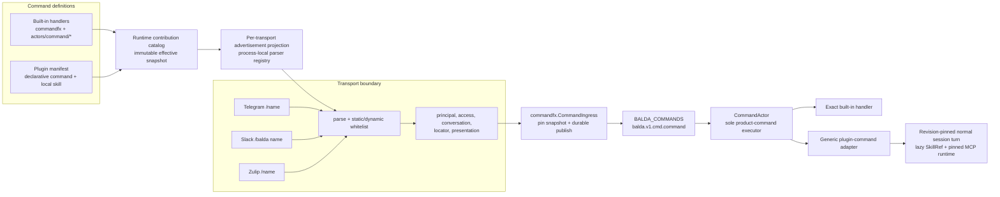
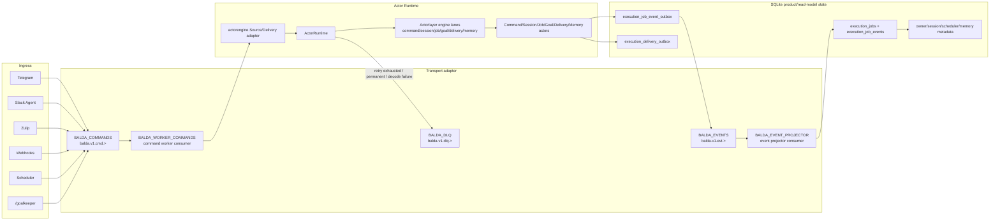

# Command architecture and runtime internals

This page is the canonical architecture reference for Balda chat commands. It
explains where command names come from, how transports admit them, and how one
durable invocation reaches product policy. For user-visible syntax and command
effects, see the [command reference](../commands.md). For non-chat work, see
the [job, scheduler, and webhook runtime](job-runtime.md).

Balda uses the word *command* at two levels:

- A **chat command** is a user invocation such as `/reset`, `/release`, or
  `/balda reset`. Every supported chat command is executed by `CommandActor`.
- A **runtime command** is any durable actor envelope. Session turns, jobs,
  delivery, questions, permissions, and chat commands all use this transport,
  but they target different product actors.

Consequently, a scheduled job or configured inbound webhook is durable command
work, but it is not a chat command and does not pass through `CommandActor`.

## Chat command architecture

The transport boundary never chooses a product handler. It accepts only a
known provider spelling, normalizes it to a canonical lowercase name, records
trusted ingress context, and publishes that neutral name. `CommandActor`
performs exact-name resolution only after durable delivery.

## Sources of commands

| Input class | Authoritative definition | Admission source | Durable target and executor |
|---|---|---|---|
| Built-in chat command | A named handler under `internal/apps/balda/actors/command`; `commandfx` assembles all handlers into one immutable router | Each enabled transport declares its static whitelist | `balda.v1.cmd.command` -> `CommandActor` -> exact built-in handler |
| Plugin chat command | The installed plugin's `plugin.json`, under `extensions.dev.baldaworks.balda.commands`; each declaration names a plugin-local skill | The current catalog projects ready, collision-free, provider-compatible aliases into the transport registry | `balda.v1.cmd.command` -> `CommandActor` -> generic plugin adapter -> normal session turn |
| Ordinary chat message | Message content from Telegram, Slack, or Zulip | Transport message/mention rules and conversational ingress | Session command -> `SessionActor`; it is not routed by command name |
| Generic inbound webhook | A configured `balda.webhooks.routes` entry and its prompt template | HTTP method, route, optional shared-header authentication, target resolution, and dedupe policy | Job mode -> `JobActor`; session mode -> `SessionActor` |
| Scheduled work | A configured `balda.scheduler.jobs` entry | Scheduler reconciliation and due-time selection | Scheduled job envelope -> `JobActor` |

The built-in router, catalog, and transport whitelist answer different
questions and are intentionally separate:

- The router says which native product handlers exist.
- The catalog says which immutable built-in and plugin contributions belong to
  a snapshot. Its built-in source is derived from the union of transport
  command declarations.
- A transport whitelist says which spellings that provider may admit. At
  startup, every enabled transport's static names are checked against the
  built-in router, so Balda fails before accepting ingress if a displayed name
  has no handler.

Transport ingress is not another command source. It may normalize provider
syntax and reject names outside its whitelist, but it cannot add a handler or
resolve a plugin revision.

## Durable chat-command path

1. The transport verifies its provider-level request and parses a static
   built-in name or a currently projected plugin alias.
2. The ingress adapter constructs `commandcmd.Request`. Its payload contains
   the canonical name and arguments plus the transport-neutral locator,
   principal, access capabilities, direct/public conversation flag,
   presentation options, and invocation root (`/` or `/balda`).
3. `commandfx.CommandIngress` resolves the effective catalog snapshot from the
   trusted session ID. It overwrites any caller-supplied version or snapshot,
   requires schema v2, and durably dispatches an envelope addressed to
   `command:<session_id>` on `balda.v1.cmd.command`.
4. `CommandActor` decodes the payload, verifies that transport and locator
   agree and that the actor key equals the locator session ID, then loads the
   exact retained snapshot named by the envelope.
5. The actor gives an exact built-in router match precedence. Otherwise it
   resolves one advertised plugin descriptor with the same canonical name,
   source, revision, and plugin-local skill reference.
6. A built-in handler applies its own access, argument, and conversation
   policy through narrow application ports. A plugin descriptor goes through
   the single generic adapter described below.

The command actor lane key is `command:<session_id>`, so commands for one
session are serialized while different sessions can proceed independently.
Ingress publishes; it does not synchronously execute session or plugin work.

Schema-v1 envelopes remain readable only for built-in commands. New ingress
cannot publish them, and a legacy envelope can never select a plugin command.
Snapshot descriptors are persisted in application KV, while immutable source
bytes are retained in the catalog revision archive. The resolver can therefore
restore the exact snapshot after a process restart; plugin purge fails closed
while a snapshot or turn still retains that revision.

## Built-in handlers and plugin turns

Built-in policy is divided into small handler families rather than one large
transport switch:

- onboarding and administration: `start`, `user`, and `plugin`;
- session information: `help`, `usage`, and `locator`;
- session lifecycle and control: `topic`, `reset`, `close`, and `cancel`;
- automation: `auto` and `goalkeeper`.

These names are native Balda policy. In particular, `/plugin install` and the
other `/plugin` management actions are built-in owner commands; they are not
plugin contributions.

A plugin contributes metadata, never a Go handler. Its declaration contains a
canonical name, description, and reference to a skill in the same immutable
plugin revision. After `CommandActor` resolves that descriptor, the generic
adapter publishes exactly one normal `SessionActor` turn. The turn text
preserves the provider invocation form, for example `/release production` or
`/balda release production`, and carries an explicit `SkillSelection` with
both snapshot ID and `SkillRef`.

The turn runner loads that exact skill body lazily. It also acquires every
plugin MCP descriptor in the same retained snapshot under that descriptor's
exact revision-qualified runtime identity for the lifetime of the turn. A
catalog refresh may affect later invocations but cannot rebind an already
published command to new skill text, another plugin, or another MCP executable.

## Transport parsing and support

The [command reference](../commands.md#invocation-and-access) is authoritative
for the user-visible built-in matrix. The runtime-specific differences are:

| Ingress | Provider syntax | Static built-ins admitted | Authentication and context | Projected plugin aliases |
|---|---|---|---|---|
| Telegram polling or Telegram webhook | `/<name> [args]` | `start`, `help`, `topic`, `goalkeeper`, `reset`, `locator`, `close`, `cancel`, `usage`, `auto`, `user`, `plugin` | Telegram user/chat/message identity; owner or collaborator capability is derived by ingress. `/start` has a separate direct-message admission path. | End-to-end through the shared registry. Alias syntax is `^[a-z][a-z0-9_]{0,31}$`. |
| Slack Agent slash-command endpoint | `/balda <name> [args]` | `locator`, `reset` | Slack HMAC signature, timestamp, team, conversation, and user are required. A valid request receives workspace-member/session-command capability; slash invocations are conversation-scoped because they contain no thread timestamp. | End-to-end through the shared registry. Alias syntax is `^[a-z][a-z0-9_-]{0,63}$`; `/balda` itself remains the single provider slash command. |
| Zulip outgoing webhook | `/<name> [args]` | `start`, `topic`, `locator`, `cancel`, `goalkeeper`, `user`, `usage`, `auto`, `reset`, `close` | The channel verifies the configured webhook token and payload; application ingress then requires owner or collaborator access except for onboarding. Direct message versus stream is preserved. | Not currently end-to-end. The channel registry recognizes compatible projected aliases, but application ingress still publishes only its static built-in set and otherwise returns `Unknown command`. See `balda-x3lz`. |
| Generic Balda webhook | Configured HTTP route, not slash syntax | None | Route/method/auth/template/target policy comes from `balda.webhooks.routes` | Not applicable: it publishes job or session work, never a chat command. |
| Scheduler | Configured cron envelope, not slash syntax | None | Configuration selects target, content, and optional report destination | Not applicable: it publishes scheduled job work, never a chat command. |

Telegram polling and Telegram webhook mode share the same command parser and
publisher. Their provider settlement boundary differs: polling advances its
offset only after accepted or terminal handling and preserves the previous
offset for retryable failure, whereas webhook settlement is local to the HTTP
request.

The dynamic registry is process-local parser eligibility, not an execution
registry and not a provider-hosted command menu. `/help` and Slack's unsupported
subcommand usage are static; use `/plugin status <plugin>` to inspect catalog,
runtime-readiness, advertisement, omission, and projection-lag state.

## Advertisement, collision, and readiness rules

When a catalog snapshot is published, the advertisement projector atomically
replaces the dynamic alias set for each enabled transport:

1. It considers only advertised plugin command descriptors.
2. The referenced skill must exist in the snapshot with the same plugin source
   and revision.
3. Every MCP server from that plugin revision must be ready under its
   revision-qualified runtime identity.
4. The alias must satisfy the target transport's syntax shown above.

An alias is withheld, rather than partially activated, if any check fails.
Diagnostics distinguish a runtime dependency failure from provider-incompatible
syntax.

Built-in names are reserved. A plugin declaration colliding with a built-in is
retained for diagnosis but not advertised. If two non-built-in contributions
claim the same canonical alias, all contenders are omitted; Balda does not
choose one by load order. Even if an invalid or stale transport request reaches
the actor, built-in exact-name routing still has precedence and an unresolved
plugin name fails closed.

Plugin manifest validation is broader than every provider's command syntax:
names must already be normalized lowercase, are limited to 64 bytes, and may
use single hyphens. The per-transport projection is therefore the final syntax
gate; for example, a valid hyphenated plugin command cannot be exposed directly
by Telegram.

## Access, retries, and identity

Ingress records capabilities; product handlers enforce them. Telegram derives
owner/collaborator access from Balda state, Slack derives workspace membership
from a valid signed slash request, and Zulip combines its verified webhook with
owner/collaborator lookup. Handler policy still decides whether a command is
owner-only, session-capable, direct-message-only, or stream-only. Plugin
commands require `SessionCommands`; plugin metadata cannot grant access or
weaken host policy.

Each provider supplies a stable invocation identity:

- Telegram: chat ID plus message ID;
- Zulip: message ID;
- Slack: a SHA-256 identity derived from the signed request timestamp and body.

`CommandIngress` uses that identity for the envelope ID, dedupe key, and initial
correlation ID. The command stream uses the dedupe key as its transport message
identity. Delivery remains at-least-once, so built-in handlers must tolerate
redelivery. The plugin adapter derives its child turn dedupe key by appending
`:plugin-turn`; replaying the same command cannot enqueue a second logical
plugin turn.

A retry resolves the original snapshot ID again. A temporary snapshot-store
failure is retryable. A snapshot or source revision that is no longer retained
returns the stable `revision_unavailable` policy result instead of falling back
to the current catalog. The transport runtime then applies the common
ack/nak/term, retry-exhaustion, and DLQ rules below.

## Maintaining the command surface

To add or change a built-in command:

1. Put product behavior in a named handler under `actors/command`, behind small
   ports owned by that handler package.
2. Register the handler in `commandfx`. Do not add a transport-specific product
   execution branch.
3. Add the canonical name only to the transports that support its provider
   syntax and context, updating both the parser whitelist and its matching
   static advertisement. The advertisement drives startup validation and
   catalog reservation.
4. Add positive tests for handler policy, each intended parser-to-ingress path,
   access/context boundaries, and durable envelope identity.
5. Update the [command reference](../commands.md) and this page when ownership,
   routing, transport availability, or settlement changes.

A plugin command does not follow this procedure: its source is the installed
manifest and plugin-local skill. Enabling the validated revision republishes
the catalog and refreshes dynamic transport projections. If a plugin alias is
missing, inspect `/plugin status` for collision, syntax, skill, MCP readiness,
or projection-lag diagnostics before changing transport code.

When adding a transport, keep its parser and provider authentication in the
concrete channel boundary, publish the neutral `commandcmd.Request` through the
composition adapter, declare its static names for startup validation, and
connect its dynamic registry to the same parser-to-ingress path. The transport
must not register product actors or implement reusable command policy.

## Command runtime semantics

Balda uses its durable transport adapter behind actorlayer dispatch, source,
delivery, retry, replay, event, and DLQ contracts. SQLite remains
product/read-model state only; it does not decide what runs, retries, or wakes
up.

- Ownership boundary:
  - The NATS transport adapter owns durable storage and wire-level settlement
    inside `internal/apps/balda/eventbus/nats`.
  - Actorlayer `Source`/`Delivery`/dispatch contracts are the boundary consumed
    by runtime, handlers, and product actors.
  - SQLite owns product state/read models (`execution_jobs`, projected
    `execution_job_events`, job-event and delivery outbox records, session metadata,
    global fact-memory KV, scheduler metadata, and session-memory ingress/audit
    rows). Canonical session-memory records are owned by the public Badger adapter.
  - Projections are derived views; projection lag/failure never blocks command
    settlement.
- Command lifecycle events (`command.accepted`, `command.running`,
  `command.in_progress`, `command.acked`, `command.retrying`,
  `command.deadlettered`, `command.noop`, `command.decode_failed`) are
  best-effort visibility telemetry. Command ack/nak/term settlement does not
  depend on successful lifecycle event publication.

### Projection rules

- Projection input source is `BALDA_EVENTS` only. Projectors must not read
  command ownership from SQLite queue rows.
- Projectors are idempotent by event identity (`event_id`/message identity) and
  can safely replay events after restart.
- The job-event outbox is publication intent, not a projection input. Its
  lifecycle worker retries pending rows and marks them published only after the
  event stream accepts the stable envelope ID.
- Projection failure does not block command execution or transport command
  settlement. Command success/failure is decided by actor side effects plus
  transport ack/nak/term only.
- Permanent projection decode/apply failures are terminated to `BALDA_DLQ`
  with source envelope and failure reason.
- Projection lag is expected and observable through operator logs and internal tooling; lag recovery happens by durable consumer catch-up.
- Read models are eventually consistent projections, not the command transport source of truth.

- Required streams:
  - `BALDA_COMMANDS`: work-queue stream for `balda.v1.cmd.>` commands.
  - `BALDA_EVENTS`: limits-retention stream for `balda.v1.evt.>` events.
  - `BALDA_DLQ`: limits-retention stream for terminal failures on
    `balda.v1.dlq.>`.
  - `BALDA_SESSION_MEMORY` (when enabled): file-backed work-queue stream for
    `balda.v1.session_memory.>` exports; `DiscardNew` preserves older pending
    exports under pressure.
- Required consumer:
  - `BALDA_WORKER_COMMANDS`: command worker consumer with explicit ack,
    redelivery, `NakWithDelay`, and `InProgress` heartbeat support.
  - `BALDA_EVENT_PROJECTOR`: event projector consumer that projects
    `BALDA_EVENTS` into SQLite read models. Permanent projection failures are
    terminated to `BALDA_DLQ`; transient failures retry with bounded delivery.
  - `BALDA_SESSION_MEMORY_WORKER` (when enabled): one-at-a-time explicit-ack
    consumer on `BALDA_SESSION_MEMORY`; worker retries retain ordering and
    publish a redacted diagnostic to `BALDA_DLQ` before termination.

### Stream/consumer table

| Name | Type | Subject filter | Retention / delivery | Key config |
|---|---|---|---|---|
| `BALDA_COMMANDS` | durable command stream | `balda.v1.cmd.>` | work-queue retention | file storage, configurable limits/discard policy |
| `BALDA_EVENTS` | durable event stream | `balda.v1.evt.>` | limits retention | file storage, replay source for projections |
| `BALDA_DLQ` | durable DLQ stream | `balda.v1.dlq.>` | limits retention | file storage, terminal failure inspection source |
| `BALDA_WORKER_COMMANDS` | command worker consumer (on `BALDA_COMMANDS`) | `balda.v1.cmd.>` | deliver-all + explicit ack | `ack_wait`, `max_deliver`, `max_ack_pending`, `fetch_batch`, `fetch_wait` |
| `BALDA_EVENT_PROJECTOR` | event projector consumer (on `BALDA_EVENTS`) | `balda.v1.evt.>` | deliver-all + explicit ack | same retry/backpressure knobs as command consumer; projector applies idempotent read-model updates |
| `BALDA_SESSION_MEMORY` | session-memory export stream (optional) | `balda.v1.session_memory.>` | work-queue retention, `DiscardNew` | `max_age`, `max_bytes`, `max_msg_size` |
| `BALDA_SESSION_MEMORY_WORKER` | session-memory consumer (optional) | `balda.v1.session_memory.>` | deliver-all + explicit ack, serialized | `ack_wait`, `fetch_wait`, worker retry and bounded shutdown |

- Stable subjects:
  - Commands: `balda.v1.cmd.command`, `balda.v1.cmd.session`,
    `balda.v1.cmd.job`, `balda.v1.cmd.goal`,
    `balda.v1.cmd.delivery`, `balda.v1.cmd.memory`,
    `balda.v1.cmd.control`, `balda.v1.cmd.question`, and
    `balda.v1.cmd.permission`.
  - Events: `balda.v1.evt.command.accepted`,
    `balda.v1.evt.command.running`, `balda.v1.evt.command.in_progress`,
    `balda.v1.evt.command.acked`, `balda.v1.evt.command.retrying`,
    `balda.v1.evt.command.deadlettered`, `balda.v1.evt.command.noop`,
    `balda.v1.evt.command.decode_failed`,
    `balda.v1.evt.job.created`,
    `balda.v1.evt.job.updated`, `balda.v1.evt.job.completed`,
    `balda.v1.evt.delivery.sent`, `balda.v1.evt.delivery.failed`.
  - DLQ: `balda.v1.dlq.command`.

### Command schema table

All commands use the common envelope schema:
`id`, `namespace`, `kind`, `from`, `to`, `payload` are required.
`session_id`, `job_id`, `correlation_id`, `causation_id`, `dedupe_key`,
`priority`, `meta`, and `report_to` are optional context fields.

| Subject | Primary routing rule | Typical namespaces | Required contextual fields | Payload contract |
|---|---|---|---|---|
| `balda.v1.cmd.command` | `to.target=command` | `chat.command` | canonical session ID in `to.key`; snapshot ID, locator, principal, and ingress capabilities in the payload | built-in or declarative plugin chat-command invocation |
| `balda.v1.cmd.session` | `to.target=session` or namespace fallback | `human.inbound` | `session_id` for existing sessions | session-turn payload (prompt/content + locator/user metadata) |
| `balda.v1.cmd.job` | `to.target=job` or namespace fallback | `webhook.inbound`, `schedule.inbound` | `job_id` for existing job mutations; optional on job creation commands | webhook job or scheduled job payload |
| `balda.v1.cmd.goal` | `to.target=goalkeeper` | `goalkeeper.command` | `job_id` for goal runs | goal objective/session payload |
| `balda.v1.cmd.delivery` | `to.target=delivery` | `agent.result` / delivery work namespaces | channel-qualified delivery address in `to.key` (`<channel_type>:<address_key>`); `job_id` when task-owned | outbound delivery payload (channel message/terminal update) |
| `balda.v1.cmd.memory` | `to.target=memory` | `memory.command` | session scope in envelope | durable memory update payload |
| `balda.v1.cmd.control` | `namespace=job.control` (forced) | `job.control` | `job_id` and/or `session_id` | cancel/control payload (`reason`, actor/user origin) |

Deduplication policy for all command subjects: transport message ID uses
`dedupe_key` when present, otherwise `id`.

### Event schema table

All events are published as the same envelope shape. For event envelopes,
`namespace=telemetry` is standard, `kind` is typically `command_event` or
`job_event`, and `meta.event_type` carries the semantic type.

| Subject | Semantic event type | Required envelope fields | Required payload fields | Producer |
|---|---|---|---|---|
| `balda.v1.evt.command.accepted` | `command.accepted` | `id`, `job_id` (when task-scoped), `namespace`, `kind=command_event` | `envelope_id`, `status=accepted`, `namespace` | command publish path |
| `balda.v1.evt.command.running` | `command.running` | same as above | `envelope_id`, `status=running` | command consumer before actor dispatch |
| `balda.v1.evt.command.in_progress` | `command.in_progress` | same as above | `envelope_id`, `status=in_progress` | runtime heartbeat during long work |
| `balda.v1.evt.command.acked` | `command.acked` | same as above | `envelope_id`, `status=acked` | command consumer after successful ack |
| `balda.v1.evt.command.retrying` | `command.retrying` | same as above | `envelope_id`, `status=retrying`, `reason` | command consumer on retryable failure |
| `balda.v1.evt.command.deadlettered` | `command.deadlettered` | same as above | `envelope_id`, `status=deadlettered`, `reason` | command consumer/DLQ publisher |
| `balda.v1.evt.command.noop` | `command.noop` | same as above | `envelope_id`, `status=noop`, `reason` | command publish dedupe path |
| `balda.v1.evt.command.decode_failed` | `command.decode_failed` | `id`, `namespace`, `kind=decode_failed` | `subject`, `reason`, `payload` | command consumer poison-message path |
| `balda.v1.evt.job.created` | `job.created` | `id`, `job_id`, `namespace`, `kind=job_event` | job lifecycle details | job lifecycle handling |
| `balda.v1.evt.job.updated` | `job.updated` | `id`, `job_id`, `namespace`, `kind=job_event` | job lifecycle details | job lifecycle handling |
| `balda.v1.evt.job.completed` | `job.completed` | `id`, `job_id`, `namespace`, `kind=job_event` | terminal job outcome details | job lifecycle handling |
| `balda.v1.evt.delivery.sent` | `delivery.sent` | `id`, `job_id` (when task-scoped), `namespace`, `kind=job_event` | delivery metadata (`delivery_key`, channel/provider ids when available) | delivery handling |
| `balda.v1.evt.delivery.failed` | `delivery.failed` | `id`, `job_id` (when task-scoped), `namespace`, `kind=job_event` | delivery failure details (`reason`, delivery metadata when available) | delivery handling |

### Idempotency rules

- Command publish idempotency:
  - transport `MsgID` is `dedupe_key` when present, otherwise envelope `id`.
  - duplicate publishes emit `command.noop` and do not create duplicate command work.
- Command consumption idempotency:
  - all handlers must tolerate redelivery (`at-least-once`).
  - terminal/canceled job commands settle as ack/noop instead of repeating side effects.
- Projection idempotency:
  - projector writes use stable event IDs and `INSERT OR IGNORE` semantics in SQLite.
  - replaying the same event stream must not duplicate projected job events.
- Delivery idempotency:
  - job-owned or otherwise durable delivery paths may reserve `delivery_key` in `execution_delivery_outbox` before provider send. Durable delivery requires an outbox store; missing outbox fails closed before dispatch.
  - duplicate delivery reservations become noop, preventing duplicate user-visible messages when that path uses the outbox.
  - ambiguous provider outcomes (network timeout, 5xx server errors, connection resets, empty responses) retain `sending` status in `execution_delivery_outbox` rather than transitioning to `failed`. Automatic resend across restarts is disabled to prevent duplicate side effects. Subsequent attempts observe the `sending` status and fail closed with a transient error without calling the provider.
  - interactive question deliveries that encounter ambiguous provider outcomes are not marked failed, preserving unconfirmed presentations.
  - Conversational session replies from Telegram, Slack, and Zulip may bypass the SQLite outbox and rely on actorlayer transport durability plus provider-side idempotent delivery handling; bypass paths do not guarantee duplicate suppression against lost provider responses.
- Job lifecycle idempotency:
  - job status transitions are guarded and terminal states are immutable.
  - repeated terminal lifecycle commands/events keep job state unchanged.

### Retry and DLQ rules

- Retry classification:
  - retryable failures are settled with `NakWithDelay` and emit `command.retrying`.
  - permanent/policy/decode terminal failures are settled with `TermWithReason` and emit/persist `command.deadlettered` or `command.decode_failed`.
- Retry schedule:
  - backoff is exponential with bounded cap (base `1s`, max `1m`), constrained by consumer `max_deliver`.
  - long-running handlers send `InProgress` heartbeats to prevent premature redelivery.
- Retry exhaustion:
  - when delivery attempts reach `max_deliver`, command is moved to `BALDA_DLQ` with bounded error reason (such as `retry_exhausted:transient`).
- DLQ payload contract (diagnostic-only):
  - Decoded command envelopes retain structural identity, routing, and safe metadata (`id`, `job_id`, `session_id`, `namespace`, `from`, `to`, `error_class`, `reason`), but replace the original payload body with diagnostic metadata (`original_kind`, `payload_bytes`, `payload_sha256`, and optional `error_class`). Raw payloads, provider credentials, and secret parameters are never persisted to DLQ.
  - Poison messages (which fail envelope decoding) publish a diagnostic telemetry envelope (`poison-<uuid>`) containing only transport source metadata (`subject`, integer `header_count`, and optional `source_stream`, `source_consumer`, `num_delivered`), sanitized decode reason, and payload diagnostics (`payload_bytes`, `payload_sha256`). Raw message bodies and header values are not retained.
- Operational triage and recovery:
  - Diagnostic DLQ records allow operators to identify failed work by ID, hash, and error category, but cannot reconstruct original message bodies from the SHA-256 hash alone.
  - Recovery requires checking evidence outside the DLQ (such as channel chat history, client logs, or upstream producer outbox). When original input is unavailable, the DLQ record alone cannot recover or replay the work.
  - If original input is located and resubmission is considered, operators must verify whether prior execution attempts produced partial side effects (e.g. external provider API calls, outbox entries, or job events), as manual resubmission carries duplicate risk.
  - Balda does not perform automatic receipt reconciliation or provide an automated command replay CLI. Developer task `task runtime-state` inspects stream and consumer status via NATS metadata, while `task projection-replay` is a developer test suite for projection idempotency, not a production command reconstruction tool.

### Failure-mode matrix

| Failure mode | Where detected | Settlement/result | User-visible impact | Operator action |
|---|---|---|---|---|
| Transport unavailable at startup | app startup/runtime bootstrap | startup fails fast | ingress not started; no work accepted | restore NATS transport and restart |
| Command publish rejected (queue pressure/transport) | ingress publish path | request rejected (`queue_full`/`dispatch_failed`) | command not accepted; no job created | inspect stream limits/backpressure, retry ingress |
| Envelope decode failure (command consumer) | command consumer decode | `TermWithReason`, publish poison record to `BALDA_DLQ`, emit `command.decode_failed` | affected message skipped; no handler side effects | inspect DLQ diagnostic metadata and source subject; fix producer/schema; re-issue from producer if input is retained upstream |
| Retryable actor/runtime error | command handler/runtime | `NakWithDelay`, emit `command.retrying` | delayed completion | inspect retries, root-cause transient dependency failures |
| Retry exhaustion (`max_deliver` reached) | command consumer | publish `BALDA_DLQ`, `TermWithReason`, emit `command.deadlettered` | job may end `deadlettered`; no further retries | inspect DLQ diagnostic entry and error class; root-cause failure; reconstruct from external producer/history if safe or cancel |
| Permanent actor/runtime error | handler/runtime classification | publish `BALDA_DLQ`, `TermWithReason` | job fails/deadletters without retry loop | inspect diagnostic error class and reason; patch code/config; re-issue from original source after assessing prior side effects |
| Projection apply/decode failure | event projector consumer | retry for transient; terminal to DLQ for permanent | command flow continues; read models may lag until replay or repair | inspect projector logs and stream status; fix bug; replay stream events via projection service |
| Delivery redelivery after partial send | delivery outbox reserve | duplicate suppressed by delivery key (noop path) | final user message not duplicated | inspect outbox row/status if delivery appears missing |
| Ambiguous provider delivery (timeout/5xx/response loss) | delivery workflow / channel adapter | retains outbox `sending` status, returns transient error, disables automatic resend | delivery outcome uncertain; message not resent automatically | inspect channel history and outbox record; manual resubmission carries duplicate risk |
| Cancellation races with queued/running work | control command handling | control command applied; canceled/terminal commands settle noop/ack | job/session stops promptly, later duplicates ignored | verify job state/events; no queue surgery needed |

- NATS command identity is carried in headers such as
  `Balda-Envelope-ID`, `Balda-Correlation-ID`, `Balda-Causation-ID`,
  `Balda-Dedupe-Key`, `Balda-Actor-Key`, `Balda-Priority`, and
  `Balda-Namespace`. Session and job context are carried in the envelope body
  and Balda metadata rather than dedicated transport headers.
- Embedded NATS binds to `127.0.0.1` by default and is not exposed externally.
  NATS transport files live under `${balda.state_dir}/nats`, which is runtime state and should
  not be committed.
- Poison command/event messages that cannot decode as Balda envelopes are
  terminated and published to `BALDA_DLQ` as diagnostic telemetry records
  containing the transport subject, header count, payload size, SHA-256 hash,
  and sanitized decode reason, without retaining raw message bodies or header values.
- Job-mutating envelopes are serialized on a single job lane
  (`job:<job_id>`) across job control, goal command/result, and job-bound
  human/webhook/schedule ingress. Different job IDs still run concurrently.
- Command consumer backpressure boundary:
  - Command worker consumer (`BALDA_WORKER_COMMANDS`) is the transport queue.
  - Local in-process worker fan-out is capped to `fetch_batch` (not `max_ack_pending`) to avoid creating a second deep in-memory queue ahead of actor lanes.
  - `max_ack_pending` remains a transport limit; it is not used as local goroutine fan-out.

### Command-path queue ownership (internal)

- Command stream (`BALDA_COMMANDS`):
  - owner: NATS transport adapter
  - capacity/backpressure: stream limits + discard policy (`balda.nats.streams.commands.*`)
  - retry/redelivery: transport consumer (`Ack`, `NakWithDelay`, `InProgress`, `Term`)
  - inspection: transport stream metadata (`messages`, `bytes`, seq range`) and logs
- Worker consumer (`BALDA_WORKER_COMMANDS`):
  - owner: NATS transport adapter
  - capacity: `max_ack_pending`
  - fetch window: `fetch_batch`, `fetch_wait`
  - inspection: transport consumer metadata (`num_pending`, `num_ack_pending`, `num_redelivered`) and logs
- Local actor delivery workers:
  - owner: process-local transport actorlayer source adapter
  - capacity: `fetch_batch` (bounded local fan-out)
  - behavior: no persistence, no retry policy; settlement remains transport-owned
- Actor lanes:
  - owner: process-local actorlayer runtime engine
  - capacity: 1 active handler per actor key (`job:<id>`, session/goal fallbacks)
  - behavior: serializes mutable job/session state transitions
- Session turn queue:
  - owner: process-local session turn dispatcher
  - capacity: bounded by turn-dispatcher queue size
  - behavior: per-session ordering/cancel semantics for provider turn execution
