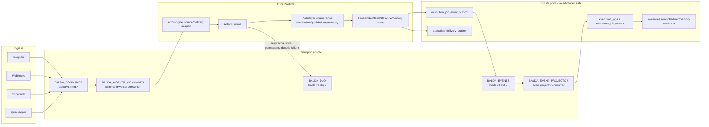

# Command runtime internals

## Command runtime semantics

Balda uses its durable transport adapter behind actorlayer dispatch, source,
delivery, retry, replay, event, and DLQ contracts. SQLite remains
product/read-model state only; it does not decide what runs, retries, or wakes
up.

- Ownership boundary:
  - The NATS transport adapter owns durable storage and wire-level settlement
    inside `internal/apps/balda/eventbus/nats`.
  - Actorlayer `Source`/`Delivery`/dispatch contracts are the boundary consumed
    by runtime, handlers, and product actors.
  - SQLite owns product state/read models (`execution_jobs`, projected
    `execution_job_events`, job-event and delivery outbox records, session metadata,
    global fact-memory KV, scheduler metadata, and session-memory ingress/audit
    rows). Canonical session-memory records are owned by the public Badger adapter.
  - Projections are derived views; projection lag/failure never blocks command
    settlement.
- Command lifecycle events (`command.accepted`, `command.running`,
  `command.in_progress`, `command.acked`, `command.retrying`,
  `command.deadlettered`, `command.noop`, `command.decode_failed`) are
  best-effort visibility telemetry. Command ack/nak/term settlement does not
  depend on successful lifecycle event publication.

### Projection rules

- Projection input source is `BALDA_EVENTS` only. Projectors must not read
  command ownership from SQLite queue rows.
- Projectors are idempotent by event identity (`event_id`/message identity) and
  can safely replay events after restart.
- The job-event outbox is publication intent, not a projection input. Its
  lifecycle worker retries pending rows and marks them published only after the
  event stream accepts the stable envelope ID.
- Projection failure does not block command execution or transport command
  settlement. Command success/failure is decided by actor side effects plus
  transport ack/nak/term only.
- Permanent projection decode/apply failures are terminated to `BALDA_DLQ`
  with source envelope and failure reason.
- Projection lag is expected and observable through operator logs and internal tooling; lag recovery happens by durable consumer catch-up.
- Read models are eventually consistent projections, not the command transport source of truth.

- Required streams:
  - `BALDA_COMMANDS`: work-queue stream for `balda.v1.cmd.>` commands.
  - `BALDA_EVENTS`: limits-retention stream for `balda.v1.evt.>` events.
  - `BALDA_DLQ`: limits-retention stream for terminal failures on
    `balda.v1.dlq.>`.
  - `BALDA_SESSION_MEMORY` (when enabled): file-backed work-queue stream for
    `balda.v1.session_memory.>` exports; `DiscardNew` preserves older pending
    exports under pressure.
- Required consumer:
  - `BALDA_WORKER_COMMANDS`: command worker consumer with explicit ack,
    redelivery, `NakWithDelay`, and `InProgress` heartbeat support.
  - `BALDA_EVENT_PROJECTOR`: event projector consumer that projects
    `BALDA_EVENTS` into SQLite read models. Permanent projection failures are
    terminated to `BALDA_DLQ`; transient failures retry with bounded delivery.
  - `BALDA_SESSION_MEMORY_WORKER` (when enabled): one-at-a-time explicit-ack
    consumer on `BALDA_SESSION_MEMORY`; worker retries retain ordering and
    publish a redacted diagnostic to `BALDA_DLQ` before termination.

### Stream/consumer table

| Name | Type | Subject filter | Retention / delivery | Key config |
|---|---|---|---|---|
| `BALDA_COMMANDS` | durable command stream | `balda.v1.cmd.>` | work-queue retention | file storage, configurable limits/discard policy |
| `BALDA_EVENTS` | durable event stream | `balda.v1.evt.>` | limits retention | file storage, replay source for projections |
| `BALDA_DLQ` | durable DLQ stream | `balda.v1.dlq.>` | limits retention | file storage, terminal failure inspection source |
| `BALDA_WORKER_COMMANDS` | command worker consumer (on `BALDA_COMMANDS`) | `balda.v1.cmd.>` | deliver-all + explicit ack | `ack_wait`, `max_deliver`, `max_ack_pending`, `fetch_batch`, `fetch_wait` |
| `BALDA_EVENT_PROJECTOR` | event projector consumer (on `BALDA_EVENTS`) | `balda.v1.evt.>` | deliver-all + explicit ack | same retry/backpressure knobs as command consumer; projector applies idempotent read-model updates |
| `BALDA_SESSION_MEMORY` | session-memory export stream (optional) | `balda.v1.session_memory.>` | work-queue retention, `DiscardNew` | `max_age`, `max_bytes`, `max_msg_size` |
| `BALDA_SESSION_MEMORY_WORKER` | session-memory consumer (optional) | `balda.v1.session_memory.>` | deliver-all + explicit ack, serialized | `ack_wait`, `fetch_wait`, worker retry and bounded shutdown |

- Stable subjects:
  - Commands: `balda.v1.cmd.session`, `balda.v1.cmd.job`,
    `balda.v1.cmd.goal`, `balda.v1.cmd.delivery`,
    `balda.v1.cmd.memory`, `balda.v1.cmd.control`.
  - Events: `balda.v1.evt.command.accepted`,
    `balda.v1.evt.command.running`, `balda.v1.evt.command.in_progress`,
    `balda.v1.evt.command.acked`, `balda.v1.evt.command.retrying`,
    `balda.v1.evt.command.deadlettered`, `balda.v1.evt.command.noop`,
    `balda.v1.evt.command.decode_failed`,
    `balda.v1.evt.job.created`,
    `balda.v1.evt.job.updated`, `balda.v1.evt.job.completed`,
    `balda.v1.evt.delivery.sent`, `balda.v1.evt.delivery.failed`.
  - DLQ: `balda.v1.dlq.command`.

### Command schema table

All commands use the common envelope schema:
`id`, `namespace`, `kind`, `from`, `to`, `payload` are required.
`session_id`, `job_id`, `correlation_id`, `causation_id`, `dedupe_key`,
`priority`, `meta`, and `report_to` are optional context fields.

| Subject | Primary routing rule | Typical namespaces | Required contextual fields | Payload contract |
|---|---|---|---|---|
| `balda.v1.cmd.session` | `to.target=session` or namespace fallback | `human.inbound` | `session_id` for existing sessions | session-turn payload (prompt/content + locator/user metadata) |
| `balda.v1.cmd.job` | `to.target=job` or namespace fallback | `webhook.inbound`, `schedule.inbound` | `job_id` for existing job mutations; optional on job creation commands | webhook job or scheduled job payload |
| `balda.v1.cmd.goal` | `to.target=goalkeeper` | `goalkeeper.command` | `job_id` for goal runs | goal objective/session payload |
| `balda.v1.cmd.delivery` | `to.target=delivery` | `agent.result` / delivery work namespaces | channel-qualified delivery address in `to.key` (`<channel_type>:<address_key>`); `job_id` when task-owned | outbound delivery payload (channel message/terminal update) |
| `balda.v1.cmd.memory` | `to.target=memory` | `memory.command` | session scope in envelope | durable memory update payload |
| `balda.v1.cmd.control` | `namespace=job.control` (forced) | `job.control` | `job_id` and/or `session_id` | cancel/control payload (`reason`, actor/user origin) |

Deduplication policy for all command subjects: transport message ID uses
`dedupe_key` when present, otherwise `id`.

### Event schema table

All events are published as the same envelope shape. For event envelopes,
`namespace=telemetry` is standard, `kind` is typically `command_event` or
`job_event`, and `meta.event_type` carries the semantic type.

| Subject | Semantic event type | Required envelope fields | Required payload fields | Producer |
|---|---|---|---|---|
| `balda.v1.evt.command.accepted` | `command.accepted` | `id`, `job_id` (when task-scoped), `namespace`, `kind=command_event` | `envelope_id`, `status=accepted`, `namespace` | command publish path |
| `balda.v1.evt.command.running` | `command.running` | same as above | `envelope_id`, `status=running` | command consumer before actor dispatch |
| `balda.v1.evt.command.in_progress` | `command.in_progress` | same as above | `envelope_id`, `status=in_progress` | runtime heartbeat during long work |
| `balda.v1.evt.command.acked` | `command.acked` | same as above | `envelope_id`, `status=acked` | command consumer after successful ack |
| `balda.v1.evt.command.retrying` | `command.retrying` | same as above | `envelope_id`, `status=retrying`, `reason` | command consumer on retryable failure |
| `balda.v1.evt.command.deadlettered` | `command.deadlettered` | same as above | `envelope_id`, `status=deadlettered`, `reason` | command consumer/DLQ publisher |
| `balda.v1.evt.command.noop` | `command.noop` | same as above | `envelope_id`, `status=noop`, `reason` | command publish dedupe path |
| `balda.v1.evt.command.decode_failed` | `command.decode_failed` | `id`, `namespace`, `kind=decode_failed` | `subject`, `reason`, `payload` | command consumer poison-message path |
| `balda.v1.evt.job.created` | `job.created` | `id`, `job_id`, `namespace`, `kind=job_event` | job lifecycle details | job lifecycle handling |
| `balda.v1.evt.job.updated` | `job.updated` | `id`, `job_id`, `namespace`, `kind=job_event` | job lifecycle details | job lifecycle handling |
| `balda.v1.evt.job.completed` | `job.completed` | `id`, `job_id`, `namespace`, `kind=job_event` | terminal job outcome details | job lifecycle handling |
| `balda.v1.evt.delivery.sent` | `delivery.sent` | `id`, `job_id` (when task-scoped), `namespace`, `kind=job_event` | delivery metadata (`delivery_key`, channel/provider ids when available) | delivery handling |
| `balda.v1.evt.delivery.failed` | `delivery.failed` | `id`, `job_id` (when task-scoped), `namespace`, `kind=job_event` | delivery failure details (`reason`, delivery metadata when available) | delivery handling |

### Idempotency rules

- Command publish idempotency:
  - transport `MsgID` is `dedupe_key` when present, otherwise envelope `id`.
  - duplicate publishes emit `command.noop` and do not create duplicate command work.
- Command consumption idempotency:
  - all handlers must tolerate redelivery (`at-least-once`).
  - terminal/canceled job commands settle as ack/noop instead of repeating side effects.
- Projection idempotency:
  - projector writes use stable event IDs and `INSERT OR IGNORE` semantics in SQLite.
  - replaying the same event stream must not duplicate projected job events.
- Delivery idempotency:
  - job-owned or otherwise durable delivery paths may reserve `delivery_key` in `execution_delivery_outbox` before provider send. Durable delivery requires an outbox store; missing outbox fails closed before dispatch.
  - duplicate delivery reservations become noop, preventing duplicate user-visible messages when that path uses the outbox.
  - ambiguous provider outcomes (network timeout, 5xx server errors, connection resets, empty responses) retain `sending` status in `execution_delivery_outbox` rather than transitioning to `failed`. Automatic resend across restarts is disabled to prevent duplicate side effects. Subsequent attempts observe the `sending` status and fail closed with a transient error without calling the provider.
  - interactive question deliveries that encounter ambiguous provider outcomes are not marked failed, preserving unconfirmed presentations.
  - Conversational session replies from Telegram, Slack, and Zulip may bypass the SQLite outbox and rely on actorlayer transport durability plus provider-side idempotent delivery handling; bypass paths do not guarantee duplicate suppression against lost provider responses.
- Job lifecycle idempotency:
  - job status transitions are guarded and terminal states are immutable.
  - repeated terminal lifecycle commands/events keep job state unchanged.

### Retry and DLQ rules

- Retry classification:
  - retryable failures are settled with `NakWithDelay` and emit `command.retrying`.
  - permanent/policy/decode terminal failures are settled with `TermWithReason` and emit/persist `command.deadlettered` or `command.decode_failed`.
- Retry schedule:
  - backoff is exponential with bounded cap (base `1s`, max `1m`), constrained by consumer `max_deliver`.
  - long-running handlers send `InProgress` heartbeats to prevent premature redelivery.
- Retry exhaustion:
  - when delivery attempts reach `max_deliver`, command is moved to `BALDA_DLQ` with bounded error reason (such as `retry_exhausted:transient`).
- DLQ payload contract (diagnostic-only):
  - Decoded command envelopes retain structural identity, routing, and safe metadata (`id`, `job_id`, `session_id`, `namespace`, `from`, `to`, `error_class`, `reason`), but replace the original payload body with diagnostic metadata (`original_kind`, `payload_bytes`, `payload_sha256`, and optional `error_class`). Raw payloads, provider credentials, and secret parameters are never persisted to DLQ.
  - Poison messages (which fail envelope decoding) publish a diagnostic telemetry envelope (`poison-<uuid>`) containing only transport source metadata (`subject`, integer `header_count`, and optional `source_stream`, `source_consumer`, `num_delivered`), sanitized decode reason, and payload diagnostics (`payload_bytes`, `payload_sha256`). Raw message bodies and header values are not retained.
- Operational triage and recovery:
  - Diagnostic DLQ records allow operators to identify failed work by ID, hash, and error category, but cannot reconstruct original message bodies from the SHA-256 hash alone.
  - Recovery requires checking evidence outside the DLQ (such as channel chat history, client logs, or upstream producer outbox). When original input is unavailable, the DLQ record alone cannot recover or replay the work.
  - If original input is located and resubmission is considered, operators must verify whether prior execution attempts produced partial side effects (e.g. external provider API calls, outbox entries, or job events), as manual resubmission carries duplicate risk.
  - Balda does not perform automatic receipt reconciliation or provide an automated command replay CLI. Developer task `task runtime-state` inspects stream and consumer status via NATS metadata, while `task projection-replay` is a developer test suite for projection idempotency, not a production command reconstruction tool.

### Failure-mode matrix

| Failure mode | Where detected | Settlement/result | User-visible impact | Operator action |
|---|---|---|---|---|
| Transport unavailable at startup | app startup/runtime bootstrap | startup fails fast | ingress not started; no work accepted | restore NATS transport and restart |
| Command publish rejected (queue pressure/transport) | ingress publish path | request rejected (`queue_full`/`dispatch_failed`) | command not accepted; no job created | inspect stream limits/backpressure, retry ingress |
| Envelope decode failure (command consumer) | command consumer decode | `TermWithReason`, publish poison record to `BALDA_DLQ`, emit `command.decode_failed` | affected message skipped; no handler side effects | inspect DLQ diagnostic metadata and source subject; fix producer/schema; re-issue from producer if input is retained upstream |
| Retryable actor/runtime error | command handler/runtime | `NakWithDelay`, emit `command.retrying` | delayed completion | inspect retries, root-cause transient dependency failures |
| Retry exhaustion (`max_deliver` reached) | command consumer | publish `BALDA_DLQ`, `TermWithReason`, emit `command.deadlettered` | job may end `deadlettered`; no further retries | inspect DLQ diagnostic entry and error class; root-cause failure; reconstruct from external producer/history if safe or cancel |
| Permanent actor/runtime error | handler/runtime classification | publish `BALDA_DLQ`, `TermWithReason` | job fails/deadletters without retry loop | inspect diagnostic error class and reason; patch code/config; re-issue from original source after assessing prior side effects |
| Projection apply/decode failure | event projector consumer | retry for transient; terminal to DLQ for permanent | command flow continues; read models may lag until replay or repair | inspect projector logs and stream status; fix bug; replay stream events via projection service |
| Delivery redelivery after partial send | delivery outbox reserve | duplicate suppressed by delivery key (noop path) | final user message not duplicated | inspect outbox row/status if delivery appears missing |
| Ambiguous provider delivery (timeout/5xx/response loss) | delivery workflow / channel adapter | retains outbox `sending` status, returns transient error, disables automatic resend | delivery outcome uncertain; message not resent automatically | inspect channel history and outbox record; manual resubmission carries duplicate risk |
| Cancellation races with queued/running work | control command handling | control command applied; canceled/terminal commands settle noop/ack | job/session stops promptly, later duplicates ignored | verify job state/events; no queue surgery needed |

- NATS command identity is carried in headers such as
  `Balda-Envelope-ID`, `Balda-Correlation-ID`, `Balda-Causation-ID`,
  `Balda-Dedupe-Key`, `Balda-Actor-Key`, `Balda-Priority`, and
  `Balda-Namespace`. Session and job context are carried in the envelope body
  and Balda metadata rather than dedicated transport headers.
- Embedded NATS binds to `127.0.0.1` by default and is not exposed externally.
  NATS transport files live under `${balda.state_dir}/nats`, which is runtime state and should
  not be committed.
- Poison command/event messages that cannot decode as Balda envelopes are
  terminated and published to `BALDA_DLQ` as diagnostic telemetry records
  containing the transport subject, header count, payload size, SHA-256 hash,
  and sanitized decode reason, without retaining raw message bodies or header values.
- Job-mutating envelopes are serialized on a single job lane
  (`job:<job_id>`) across job control, goal command/result, and job-bound
  human/webhook/schedule ingress. Different job IDs still run concurrently.
- Command consumer backpressure boundary:
  - Command worker consumer (`BALDA_WORKER_COMMANDS`) is the transport queue.
  - Local in-process worker fan-out is capped to `fetch_batch` (not `max_ack_pending`) to avoid creating a second deep in-memory queue ahead of actor lanes.
  - `max_ack_pending` remains a transport limit; it is not used as local goroutine fan-out.

### Command-path queue ownership (internal)

- Command stream (`BALDA_COMMANDS`):
  - owner: NATS transport adapter
  - capacity/backpressure: stream limits + discard policy (`balda.nats.streams.commands.*`)
  - retry/redelivery: transport consumer (`Ack`, `NakWithDelay`, `InProgress`, `Term`)
  - inspection: transport stream metadata (`messages`, `bytes`, seq range`) and logs
- Worker consumer (`BALDA_WORKER_COMMANDS`):
  - owner: NATS transport adapter
  - capacity: `max_ack_pending`
  - fetch window: `fetch_batch`, `fetch_wait`
  - inspection: transport consumer metadata (`num_pending`, `num_ack_pending`, `num_redelivered`) and logs
- Local actor delivery workers:
  - owner: process-local transport actorlayer source adapter
  - capacity: `fetch_batch` (bounded local fan-out)
  - behavior: no persistence, no retry policy; settlement remains transport-owned
- Actor lanes:
  - owner: process-local actorlayer runtime engine
  - capacity: 1 active handler per actor key (`job:<id>`, session/goal fallbacks)
  - behavior: serializes mutable job/session state transitions
- Session turn queue:
  - owner: process-local session turn dispatcher
  - capacity: bounded by turn-dispatcher queue size
  - behavior: per-session ordering/cancel semantics for provider turn execution
