# Internal packages and startup architecture

## Key internal package dependencies

This is a high-level map of Balda-owned internal packages. It is intentionally
selective rather than a full `go list` import dump.

```mermaid
flowchart TB
    balda_root["github.com/baldaworks/balda/internal/apps/balda"]
    agent["github.com/baldaworks/balda/internal/apps/balda/agent"]
    actorcmd["github.com/baldaworks/balda/internal/apps/balda/actorcmd"]
    actors["github.com/baldaworks/balda/internal/apps/balda/actors"]
    commandcmd["github.com/baldaworks/balda/internal/apps/balda/commandcmd"]
    commandfx["github.com/baldaworks/balda/internal/apps/balda/commandfx"]
    auth["github.com/baldaworks/balda/internal/apps/balda/auth"]
    telegram["github.com/baldaworks/balda/internal/apps/balda/channel/telegram"]
    handlers["github.com/baldaworks/balda/internal/apps/balda/handlers"]
    internalmcp["github.com/baldaworks/balda/internal/apps/balda/internalmcp"]
    memory["github.com/baldaworks/balda/internal/apps/balda/memory"]
    session["github.com/baldaworks/balda/internal/apps/balda/session"]
    sessionturn["github.com/baldaworks/balda/internal/apps/balda/sessionturn"]
    state["github.com/baldaworks/balda/internal/apps/balda/state"]
    runtime["github.com/baldaworks/balda/internal/apps/balda/execution"]
    jobs["github.com/baldaworks/balda/internal/apps/balda/jobs"]
    tgbotkit["github.com/baldaworks/balda/internal/apps/balda/tgbotkit"]
    welcome["github.com/baldaworks/balda/internal/apps/balda/welcome"]

    balda_root --> agent
    balda_root --> actors
    balda_root --> commandfx
    balda_root --> actorcmd
    balda_root --> auth
    balda_root --> handlers
    balda_root --> internalmcp
    balda_root --> memory
    balda_root --> state
    balda_root --> runtime
    balda_root --> jobs
    balda_root --> tgbotkit

    actors --> agent
    actors --> telegram
    actors --> session
    actors --> state
    actors --> actorcmd
    actors --> jobs

    telegram --> session

    handlers --> auth
    handlers --> commandcmd
    handlers --> session
    handlers --> deliverycmd
    handlers --> turncmd
    handlers --> welcome

    runtime --> actorcmd

    jobs --> actorcmd
    jobs --> state

    sessionturn --> actors
    sessionturn --> memory
    sessionturn --> session

    session --> agent
    session --> state
```

### Dependency Summary

| Package | Import Path | Description | Depends On |
|---------|-------------|-------------|------------|
| `balda` | `internal/apps/balda` | Root application module | actors, agent, auth, handlers, jobs, memory, runtime, state, tgbotkit |
| `actorcmd` | `internal/apps/balda/actorcmd` | Leaf actor targets, namespaces, subjects, headers, and job-scope metadata | `github.com/baldaworks/go-actorlayer` |
| `agent` | `internal/apps/balda/agent` | Provider-backed runtime construction, root runtime prompt/session-state bootstrap, isolated goal runtime preparation, and runtime-adjacent workspace support | `internal/git`, runtime/agent factory packages |
| `actors` | `internal/apps/balda/actors` | Balda product actor behavior | actorcmd, agent, channel, jobs, session, state |
| `actors/command` | `internal/apps/balda/actors/command` | Independent CommandActor, exact-name router, and actor-owned locator/reset policy | actorcmd, commandcmd, delivery contracts, local ports |
| `commandcmd` | `internal/apps/balda/commandcmd` | Neutral command envelope and transport advertisement contracts | actorcmd, deliverycmd, deliveryfmt |
| `commandfx` | `internal/apps/balda/commandfx` | CommandActor registration and port wiring | actors/command, session, runtime interfaces |
| `auth` | `internal/apps/balda/auth` | Owner authentication store | state (interface) |
| `channel/telegram` | `internal/apps/balda/channel/telegram` | Telegram transport package: adapter, delivery formatting, and message sending | session, `tgbotkit/client` |
| `handlers` | `internal/apps/balda/handlers` | Ingress parsing, access checks, and durable publication; legacy commands remain here pending scoped migration | auth, commandcmd, deliverycmd, turncmd |
| `internalmcp` | `internal/apps/balda/internalmcp` | Bundled MCP server lifecycle | controlmcp, memory, session |
| `memory` | `internal/apps/balda/memory` | Global explicit-fact store and `balda.memory.*` MCP tools | (standalone) |
| `session` | `internal/apps/balda/session` | Session management | agent, state |
| `sessionturn` | `internal/apps/balda/sessionturn` | Queued-turn restoration and execution orchestration | memory, session |
| `sessionturnapp` | `internal/apps/balda/sessionturnapp` | Queued turn execution wiring, provider-turn execution, progress dispatch, and turn-facing adapters | jobs, memory, session, sessionturn, `github.com/baldaworks/go-actorlayer` |
| `state` | `internal/apps/balda/state` | SQLite state persistence | `modernc.org/sqlite`, `updatepoller` |
| `sessionmemory` | `sessionmemory` | Portable session-memory semantic core and canonical contracts | standard library |
| `sessionmemory/app` | `sessionmemory/app` | Portable runtime, typed ingest, recall, trace, forget, and lifecycle ports | `sessionmemory` |
| `sessionmemory/store/badger` | `sessionmemory/store/badger` | Canonical Badger persistence and maintenance | `sessionmemory`, `sessionmemory/app`, Badger |
| `sessionmemory/index/bleve` | `sessionmemory/index/bleve` | Rebuildable lexical projection | `sessionmemory`, `sessionmemory/app`, Bleve |
| `sessionmemory/mcp` | `sessionmemory/mcp` | Neutral `session_memory.search` and `session_memory.trace` adapter | `sessionmemory`, MCP SDK |
| `sessionmemoryapp` | `internal/apps/balda/sessionmemoryapp` | Balda capture, redaction, ingress outbox, worker, and host adapters | public session-memory packages, Balda transport ports |
| `sessionmemorymcp` | `internal/apps/balda/sessionmemorymcp` | Authenticated broker/context bridge for neutral MCP | Balda session/locator contracts |
| `runtime` | `internal/apps/balda/execution` | Actor runtime host, lane policy, retry/dead-letter policy, and delivery wrapping | actorcmd, `github.com/baldaworks/go-actorlayer` |
| `jobs` | `internal/apps/balda/jobs` | Durable job service, transactional event outbox, and read-model projection | actorcmd, state, `github.com/baldaworks/go-actorlayer` |
| `tgbotkit` | `internal/apps/balda/tgbotkit` | Telegram bot runtime | `tgbotkit/*` |
| `welcome` | `internal/apps/balda/welcome` | Welcome message builder | (standalone) |

## Actorlayer Boundary

Balda treats `actorlayer` as the reusable actor library boundary and never as product policy.

## Architecture Layers

- `github.com/baldaworks/go-actorlayer`: generic actor library only. It owns envelopes, addressing, lane execution primitives, retry/error helpers, and transport-facing contracts. It does not own Balda product policy.
- `internal/apps/balda/actorcmd`: stable leaf package for product wire taxonomy. It owns actor targets, namespaces, kinds, subjects, headers, and job-scope metadata.
- `internal/apps/balda/execution`: Balda runtime policy. It owns the host loop, lane policy, dead-letter handling, heartbeat policy, and runtime-facing transport wiring.
- `internal/apps/balda/agent`: provider-backed runtime support. It owns root runtime construction, prompt/session-state bootstrap, isolated goal runtime preparation, and runtime-adjacent workspace support. It does not own session lifecycle semantics.
- `internal/apps/balda/jobs`: durable job orchestration state and event projection. It owns job records, job events, and read-model updates, but it does not own transport execution.
- `internal/apps/balda/actors`: product actors. It owns session, job, goalkeeper, delivery, control, and memory behavior.
- `internal/apps/balda/sessionturn`: queued-turn restoration behind a narrow executor port.
- `internal/apps/balda/sessionturnapp`: queued turn execution wiring, provider execution, progress dispatch, and turn-specific adapters.
- `internal/apps/balda/internalmcp`: bundled MCP construction and lifecycle.
- `internal/apps/balda/handlers`: transport ingress only. It normalizes Telegram/Slack/Zulip/webhook/scheduler input, checks auth/session rules, and publishes actor work. It must not own product actors, provider-turn execution, or delivery policy.
- `internal/apps/balda/handlersfx`: composition-root adapters that bind handler-owned ports to concrete provider runtimes without moving ingress policy into wiring.
- `internal/apps/balda/channel/*`: concrete channel delivery semantics. They adapt provider-specific messaging APIs behind Balda delivery commands.
- `internal/apps/balda/state`: SQLite-backed product state and read models. It owns sessions, scheduler state, job tables, delivery idempotency, and the session-memory ingress outbox/audit records. It does not own canonical session-memory domain state.
- `internal/apps/balda/memory`: separate global explicit-fact memory (`balda.memory.read`, `balda.memory.remember`, and `MEMORY.md` import). It is not the session-memory subsystem.
- `sessionmemory` and `sessionmemory/app`: portable semantic ownership and capability orchestration for exact-scope session memory.
- `sessionmemory/store/badger`: canonical session-memory state; `sessionmemory/index/bleve`: rebuildable lexical projection.
- `sessionmemory/mcp`: neutral search/trace tools; Balda's `sessionmemorymcp` supplies authenticated scope context and no transport locator is accepted from tool input.

- `balda.provider` selects one app-scoped provider runtime for all Balda sessions and `/goalkeeper` worker-validator runs in the process. `/goalkeeper` still creates isolated worker/validator ADK sessions and workspace state, but it reuses the same provider runtime/client ownership as normal session turns.
- Actorlayer owns generic actor mechanics: registration, addressing, envelopes, retry/error helpers, lane execution, lifecycle state, and transport-facing contracts.
- Balda owns product actors and product behavior implemented as actors: session turns, job routing, goal execution, delivery, control, and memory.
- Balda exposes its durable transport to product/runtime code only as actorlayer source, delivery, and dispatch abstractions; the concrete transport stays inside the NATS adapter.

The boundary is intentionally explicit:

- Balda owns retry, dead-letter, queue visibility, and job projection policy.
- Actor command contracts expose only actor-level contracts and metadata (`chat_id`, `topic_id`, `goal_id`, `attempt`).
- Runtime command flow and projectors are preserved by keeping queue/provider details outside actor definitions.

### Migration Checklist

- Keep Balda product actor definitions in `internal/apps/balda/actors`; keep ingress/Telegram command handling in `internal/apps/balda/handlers`.
- Keep actor definitions and state types independent from provider IDs.
- Ensure no provider or queue API types enter the actor layer contract.
- Keep retry/dead-letter policy, projection writes, and reporting in Balda-owned modules.
- Preserve command envelope metadata (`chat_id`, `topic_id`, `goal_id`) at the actorlayer boundary.
- Verify job/actor scenarios through the configured `balda.provider` runtime and actorlayer dispatch path.

### Implementation Map

Balda's actorlayer integration is intentionally direct:

- `internal/apps/balda/execution/host.go`: consumes an `actorlayer/engine.Source` and owns actor lane execution.
- `internal/apps/balda/actors`: defines Balda product actors for session, job, goal, delivery, control, and memory command contracts.
- `internal/apps/balda/handlers`: owns ingress normalization, command parsing, precondition checks, and durable actor-command publication.
- `internal/apps/balda/handlersfx`: binds handler-owned ports to concrete provider runtimes at the composition root.
- `internal/apps/balda/sessionturn`: owns queued session restore/create and delegates the provider iteration to the executor adapter.
- `internal/apps/balda/actorcmd`: owns product command/event wire constants shared by actors, runtime, jobs, and ingress.
- `internal/apps/balda/eventbus/nats`: adapts transport publish, fetch, ack, retry, in-progress heartbeat, terminal dead-letter, and event-stream publishing into actorlayer source/delivery/dispatch contracts.
- `internal/apps/balda/agent`: owns the single app-scoped provider runtime selected by `balda.provider`, root runtime construction, isolated goal runtime preparation, and runtime-adjacent workspace support.
- `internal/apps/balda/session`: owns per-session lifecycle state, restore/ensure semantics, and runtime/session binding.
- `internal/apps/balda/state`: owns SQLite product/read-model state for sessions, jobs, projections, global-memory KV, delivery outbox rows, and session-memory ingress/audit rows. Canonical session-memory records live in the public Badger adapter.
- `sessionmemory/app` and `internal/apps/balda/sessionmemoryapp`: own typed semantic processing versus Balda capture/redaction/outbox/worker wiring respectively.

Do not add extra Balda-local actor adapter packages or execution/delivery selector
layers around the runtime. The generic actor runtime lives in `github.com/baldaworks/go-actorlayer`,
and Balda keeps product policy in Balda.

## Startup Order (Required)

Balda startup order is strict:

1. Load runtime + Balda config, then construct and validate the immutable delivery-format registry.
2. Start internal MCP lifecycle manager.
3. Start the enabled portable session-memory runtime (canonical Badger, Bleve projection, and model lifecycle).
4. Start Balda provider runtime via `RuntimeManager.EnsureRuntime(...)`.
5. Start session/mailbox and durable actor infrastructure: event projector, job-event outbox publisher, and actor host.
6. Bootstrap Telegram owner state, then start scheduler, inbound webhooks, Zulip, Slack, and Telegram ingress.

One composition-root coordinator owns this order. Configuration or registry
errors fail before any ingress stage can become ready. Shutdown runs the same
stages in reverse, so ingress stops before actor/provider/MCP resources.

Internal MCP v1 scope is config + lifecycle plumbing; server implementations can be added incrementally.
